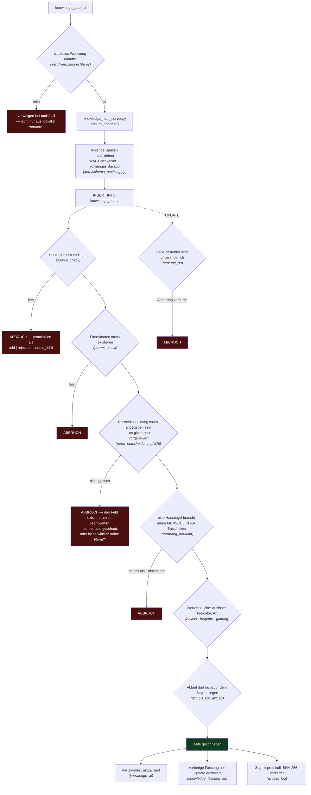
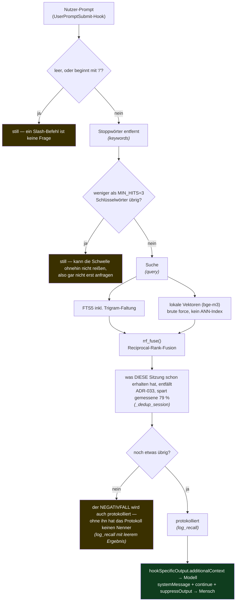
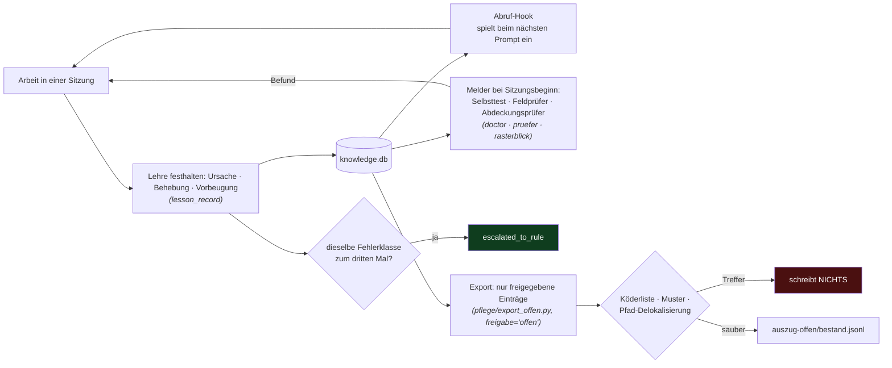

# brainlehr 0.1.0

**Ein Wissensspeicher, der sich meldet.**

Übliche Speicher warten auf eine Frage und liefern ähnlichen Text. brainlehr
tut fünf Dinge, die ein Archiv nicht tut:

- **Es meldet sich ungefragt.** Bei jeder Antwort prüft es, ob darin ein
  Gesetz, eine Norm oder eine interne Kennung zitiert wird — und ob dafür ein
  Beleg im Bestand liegt. Fehlt er, sagt es das.
- **Es schlägt vor, was fehlt.** Wiederkehrende Handgriffe werden zu
  Werkzeugvorschlägen samt fertigem Auftrag. Wiederholt sich eine Fehlerklasse
  dreimal, wird sie von selbst zur Regel.
- **Es widerspricht.** Ein Eintrag ohne nachprüfbare Herkunft entsteht gar
  nicht erst — das erzwingt ein Datenbank-Trigger, nicht eine Konvention.
- **Es kennzeichnet fremden Text als Daten.** Nicht per Wortliste (die ist
  prinzipiell unvollständig), sondern durch die Darstellung selbst.
- **Es misst sich selbst.** Trefferquote, Nutzen, Rangfolge — gegen einen
  fremden Prüfkorpus, blind bewertet. Die Zahlen fallen regelmäßig schlecht
  aus; das ist der Zweck.

Läuft als **MCP-Server** auf SQLite — funktioniert also mit jedem MCP-Klienten:
Claude Code und Desktop, Codex, [Hermes](https://hermes-agent.nousresearch.com/)
oder einem eigenen. *Offline* bezieht sich auf den **Speicher**, nicht auf das
Modell: Die Datenbank, der Volltextindex und die Vektoren bleiben auf der
Maschine. Mit welchem Modell gesprochen wird, ist frei wählbar — ein
gehosteter Dienst ist unproblematisch, er sieht ohnehin nie mehr als das, was
der Klient ihm schickt.

> **Fassung 0.1.0.** Die führende Null ist die Aussage: keine feste
> Schnittstelle, kein Versprechen der Aufwärtskompatibilität. Was
> funktioniert, ist belegt — was versprochen wird, ist es nicht.
>
> **Als Nächstes.** Die Arbeit pausiert bis 2026-08-10T23:00+02:00. Danach ist
> 0.1.1 wahrscheinlich — wahrscheinlich, weil auch das kein Versprechen ist.

> 🇬🇧 English version: [`README.md`](./README.md)

---

## Wofür es da ist

Ein Sprachmodell vergisst zwischen zwei Sitzungen alles. Die übliche Abhilfe
legt Text in eine Vektordatenbank und ruft ihn per Ähnlichkeit ab. Das
beantwortet *worüber haben wir gesprochen* — aber nicht:

- **Wer** hat das behauptet, und wurde es je geprüft?
- Gilt es **noch**, oder ist es überholt?
- Was, wenn sich **zwei Einträge widersprechen**?
- **Wirkt** der Speicher überhaupt, oder liefert er nur Treffer?

brainlehr beantwortet diese vier Fragen mit Feldern und Messungen statt mit
Zuversicht.

## Schnellstart

```bash
python3 schnellstart.py
```

Das legt eine leere, durch Regeln geschützte Datenbank an, schreibt
brainlehrs Selbstbeschreibung hinein und **prüft am Ende**, ob die frische
Instanz die Frage `was kannst du` beantwortet. Wenn nicht, bricht das Skript
mit einem Fehler ab, statt eine Erfolgsmeldung auszugeben.

```bash
python3 schnellstart.py --bestand              # + Beispielbestand (u. a. NASA LLIS)
python3 schnellstart.py --bestand --vektoren   # + semantische Suche, lokal berechnet
```

Vektoren sind **optional**: Volltextsuche funktioniert auch ohne sie, und ihre
Berechnung dauert je nach Maschine Minuten bis Stunden. Begründung in
[`docs/AUFBAU.md`](./docs/AUFBAU.md).

Als MCP-Server starten, und die Kernmodule prüfen:

```bash
python3 knowledge_mcp_server.py          # stdio-Transport

python3 kern/ausweis.py --selftest       # Identität / Zugangsdaten
python3 kern/werkzeugrechte.py --selftest # Werkzeugrechte
python3 kern/schema_nachzug.py --selftest # Schema-Nachzug
```

Das Skript gibt am Ende die MCP-Konfigurationszeile aus. Der Text, den ein
Sprachmodell zuerst lesen sollte, steht in [`START_HIER.md`](./START_HIER.md).

Temporärer Sitzungszustand läuft über drei MCP-Werkzeuge:
`session_checkpoint_setzen`, `session_checkpoint_lesen` und
`session_checkpoint_schliessen`. Ein Checkpoint enthält nur technische IDs; er
wird nicht durchsucht und nicht bei jedem Prompt eingespielt. Wird er mit
einem aktuellen Themen-Fingerabdruck gelesen, liefert er eine deterministische
Empfehlung: Sichern bei 75/88 % Kontext, zuerst offene Agenten integrieren,
und einen neuen Chat erst nach einem echten Themenwechsel mit vollständiger
Übergabe empfehlen.

Einen Bestand zwischen Instanzen zu bewegen läuft über den einen Einstiegspunkt
— Zeile für Zeile, nicht durch Kopieren der Datenbankdatei, weil SQLite-Dateien
sich nicht zusammenführen lassen und git sie schlicht überschreiben würde:

```bash
python3 brainlehr.py init  <zielverzeichnis>   # einen frischen Ort einrichten
python3 brainlehr.py raus  auszug.jsonl         # Bestand ausschreiben
python3 brainlehr.py rein  auszug.jsonl --db knowledge.db   # wieder einlesen
python3 brainlehr.py haken --einbauen           # Hooks verdrahten
```

## Als Paket installieren

Zwei Wege hinein. Der obige geht vom **Klon** aus — dieser braucht gar keinen:

```bash
pip install brainlehr          # noch nicht auf PyPI; bis dahin: pip install <rad>
brainlehr-einrichten           # legt den Bestand an, belegt sich selbst, hoert auf
```

Der Bestand landet in `~/.brainlehr/brainlehr.db`, **nicht** im installierten
Paket — gemessen 2026-08-23: Ein Vorgabepfad unter `site-packages` wird vom
nächsten `pip install --upgrade` gelöscht, lautlos, weil niemand seine Daten
dort vermutet.

Danach den Server eintragen. `brainlehr-mcp` liegt nach der Installation im
`PATH`, keiner dieser Befehle braucht also einen absoluten Pfad:

```bash
claude mcp add --transport stdio --scope user brainlehr -- brainlehr-mcp
codex mcp add brainlehr -- brainlehr-mcp
```

Für Hermes ist brainlehr kein einfacher MCP-Server, sondern ein
Speicher-Anbieter — siehe [`integrations/hermes/`](./integrations/hermes/).

Wer **im Klon** dieses Repos arbeitet, braucht für Claude Code gar nichts:
[`.mcp.json`](./.mcp.json) liegt bei und meldet den Server für das Projekt an.

Der Bestand startet **leer, und das ist richtig** — dieses Paket liefert kein
Wissen mit, auch nicht unseres. Nachschlagewerke (BSI, NASA LLIS, WCAG) holt
die Einrichtung aus der **Ursprungsquelle**, damit jeder sie beim Rechteinhaber
bezieht. Nichts geht ins Netz, ohne dass man es sagt.

## Einrichtung per eingefügtem Prompt

Einen der folgenden Texte an den eigenen Agenten geben. Jeder klont,
installiert, prüft und verdrahtet brainlehr in die eigene Konfiguration des
jeweiligen Klienten. Die Syntax wurde am 2026-08-10 gegen die Dokumentation
jedes Anbieters geprüft — hat sich ein Klient seither geändert, sagt der
Prompt das, statt zu raten.

<details>
<summary><b>Claude Code</b></summary>

```text
Set up brainlehr, a local MCP knowledge store, on this machine.

1. Clone https://github.com/3lehr/brainlehr.git into a directory I choose —
   ask me for it, do not assume one. Then cd into it.
2. Create a venv and install: python3 -m venv .venv && source .venv/bin/activate
   && pip install -r requirements.txt
3. Run `python3 schnellstart.py`. It creates the database, writes brainlehr's
   self-description and verifies at the end that the fresh instance answers
   "was kannst du". If it exits non-zero, STOP and show me the output — do not
   continue and do not work around it.
4. Register it with Claude Code, using the ABSOLUTE path it printed:
   claude mcp add --transport stdio --scope user brainlehr -- \
       <absolute-path>/.venv/bin/python3 <absolute-path>/knowledge_mcp_server.py
5. Verify: `claude mcp list` must show brainlehr as connected. Then restart the
   session and call knowledge_search("was kannst du"). Report the number of
   hits. Zero hits means step 3 did not do what it claimed — say so.
6. Read START_HIER.md and follow it from then on.
7. Do NOT set up credentials, and do not invent one. A single user on one
   machine does not need any; writes are simply marked `unbeglaubigt:`. If I
   ever ask for it, the secret is mine to paste — not yours to read or create.

Do not edit any file in the repository during setup. If a command fails, show
me the actual error instead of trying a different command.
```
</details>

<details>
<summary><b>Codex / ChatGPT Desktop</b></summary>

```text
Set up brainlehr, a local MCP knowledge store, on this machine.

1. Clone https://github.com/3lehr/brainlehr.git into a directory I choose —
   ask me for it, do not assume one. Then cd into it.
2. python3 -m venv .venv && source .venv/bin/activate
   && pip install -r requirements.txt
3. Run `python3 schnellstart.py`. It verifies itself at the end. If it exits
   non-zero, STOP and show me the output — do not work around it.
4. Register it in ~/.codex/config.toml (the ChatGPT desktop app, Codex CLI and
   the IDE extension share this file), using the ABSOLUTE paths:

   [mcp_servers.brainlehr]
   command = "<absolute-path>/.venv/bin/python3"
   args = ["<absolute-path>/knowledge_mcp_server.py"]

   Equivalent CLI form:
   codex mcp add brainlehr -- <absolute-path>/.venv/bin/python3 \
       <absolute-path>/knowledge_mcp_server.py
5. Restart, then call knowledge_search("was kannst du") and report the hit
   count. Zero hits means step 3 did not do what it claimed — say so.
6. Read START_HIER.md and follow it from then on.
7. Do NOT set up credentials, and do not invent one. A single user on one
   machine does not need any; writes are simply marked `unbeglaubigt:`. If I
   ever ask for it, the secret is mine to paste — not yours to read or create.

Do not edit any file in the repository during setup. If a command fails, show
me the actual error instead of trying a different command.
```
</details>

<details>
<summary><b>Hermes Agent</b></summary>

```text
Set up brainlehr, a local MCP knowledge store, on this machine.

1. Clone https://github.com/3lehr/brainlehr.git into a directory I choose —
   ask me for it, do not assume one. Then cd into it.
2. python3 -m venv .venv && source .venv/bin/activate
   && pip install -r requirements.txt
3. Run `python3 schnellstart.py`. It verifies itself at the end. If it exits
   non-zero, STOP and show me the output — do not work around it.
4. Register it in ~/.hermes/config.yaml under mcp_servers, using ABSOLUTE
   paths:

   mcp_servers:
     brainlehr:
       command: "<absolute-path>/.venv/bin/python3"
       args: ["<absolute-path>/knowledge_mcp_server.py"]

   Note: Hermes prefixes tool names as mcp_brainlehr_<tool>. If you write any
   rule that matches on a tool name, use the prefixed form.
5. Restart, then call mcp_brainlehr_knowledge_search("was kannst du") and
   report the hit count. Zero hits means step 3 did not do what it claimed.
6. Read START_HIER.md and follow it from then on.
7. Do NOT set up credentials, and do not invent one. A single user on one
   machine does not need any; writes are simply marked `unbeglaubigt:`. If I
   ever ask for it, the secret is mine to paste — not yours to read or create.

Do not edit any file in the repository during setup. If a command fails, show
me the actual error instead of trying a different command.
```
</details>

Drei Dinge tut jeder dieser Prompts absichtlich:

- **Er fragt nach dem Zielort**, statt selbst ein Verzeichnis zu wählen. Ein
  Agent, der selbst entscheidet, legt es dorthin, wo man es nicht wiederfindet.
- **Er verbietet, einen Fehlschlag zu umgehen.** `schnellstart.py` endet mit
  einer Prüfung und bricht mit Fehlercode ab, wenn die frische Instanz nicht
  antworten kann. Ein Agent, der das "repariert", indem er den Schritt
  überspringt, übergibt einen Speicher, der nur installiert aussieht.
- **Er verlangt eine Zahl, kein Urteil.** "Nenne die Trefferzahl" kann falsch
  sein und als falsch erkannt werden; "es funktioniert" nicht.

## Was tatsächlich drinsteckt

| | |
|---|---|
| **Herkunft** | `source` ist Pflicht, per Datenbank-Trigger erzwungen; Herkunftsfelder sind nach dem Schreiben unveränderlich |
| **Geltung** | `norm_rang`, `gilt_ab`/`gilt_bis` und eine ausdrückliche Normentscheidung **ohne Vorgabewert** |
| **Identität** | **nicht erforderlich** — eine Person an einer Maschine schreibt ohne jede Zugangsdaten, jeder Eintrag ist schlicht mit `unbeglaubigt:` markiert. Sobald Zugangsdaten existieren, kann Identität im Aufruf nicht mehr behauptet werden: Sie wird per scrypt geprüft. Die Durchsetzung bleibt weich, außer bei `BRAINLEHR_DURCHSETZUNG=streng` — siehe [Zugangsdaten](#zugangsdaten--kann-man-uebergehen) |
| **Zwei Wissensarten** | *Knoten* tragen Fakten, *Lehren* tragen Fehlerklassen mit Ursache, Behebung und Vorbeugung |
| **Hybride Suche** | FTS5 samt Trigram, plus lokale Vektoren (bge-m3), per RRF fusioniert — vollständig auf dem Gerät |
| **Assoziative Kanten** | verstärken, was gemeinsam abgerufen wird; eine Kante bedeutet "kam zusammen vor", nicht "hängt inhaltlich zusammen" |
| **Zugriffsprotokoll** | jeder Lese- und Schreibzugriff in `access_log`, per SHA-256 verkettet — Manipulation wird nachweisbar, nicht unmöglich |

## Wie es funktioniert

Drei Abläufe, aus dem Code entnommen wie er am 2026-08-10 steht. Die
Trigger-Namen sind die tatsächlichen aus `schema.sql`; die Schwellenwerte
sind die gemessenen.

### Eine Anmerkung zu den deutschen Bezeichnern

Diese Tabelle wird zum Lesen der Diagramme nicht gebraucht — sie nennen, was
jeder Schritt auf Englisch tut, und geben den deutschen Namen in Klammern
dazu, weil man genau danach im Code greppen wird. Hier die Übersicht für den
Moment, in dem man sie braucht:

| Bezeichner | Bedeutung |
|---|---|
| `herkunft` / `source` | Herkunft |
| `freigabe` | Freigabestufe: `intern` (Vorgabe) · `offen` · `gesperrt` |
| `gattung` | Art: `arbeitsbestand` (Arbeitsbestand) · `nachschlagewerk` (Nachschlagewerk, aus dem automatischen Abruf ausgenommen) |
| `anlass` | Auslöser: was den Eintrag verursacht hat (`betreiber`, `selbst`, `hook`, `skript`) |
| `norm_rang` · `gilt_ab` · `gilt_bis` | Normrang · gültig ab · gültig bis |
| `unbeglaubigt` | unbeglaubigt — keine Zugangsdaten vorgelegt |
| `pruefer` · `rasterblick` · `doctor` | die Melder: Feldprüfer · Abdeckungsprüfer · Selbsttest |
| `pflege/` · `kern/` · `melder/` · `haken/` | Pflege · Kern · Melder · Hooks |
| `parent_check` · `source_check` | Trigger: Elternknoten muss existieren · Herkunft muss vorliegen |
| `norm_entscheidung_pflicht` | Trigger: die Normentscheidung hat keinen Vorgabewert — sie muss angegeben werden |
| `normrang_herkunft` | Trigger: eine Hausregel braucht einen *menschlichen* Entscheider |
| `herkunft_bu` | Trigger: Herkunftsfelder sind nach dem Schreiben unveränderlich |
| `knowledge_fassung_au` | Trigger: archiviert bei einem Update die vorherige Fassung |
| `access_log` | das Zugriffsprotokoll — jeder Lese- und Schreibzugriff, SHA-256-verkettet |

Trigger-Namen enden auf zwei Buchstaben, die sagen, **wann** sie feuern:
`_bi` vor dem Insert, `_bu` vor dem Update, `_ai` nach dem Insert, `_au` nach
dem Update, `_ad` nach dem Delete. `herkunft_bu` heißt also "Herkunft, vor
Update" — er ist es, der eine Änderung an einem Herkunftsfeld verweigert.

Warum sie nicht umbenannt werden: Die Überlegung hinter diesem Projekt wurde
auf Deutsch geschrieben, und die Bezeichner tragen diese Überlegung mit.
`gilt_bis` und `valid_until` sind dasselbe Feld; `Geltung` und `validity`
sind nicht ganz derselbe Gedanke.

### 1. Schreiben — jede Schranke sitzt in der Datenbank, nicht beim Aufrufer

Ein Schreibvorgang wird von SQLite selbst verweigert. Ein Agent, der die
Herkunft vergisst, erzeugt keinen schlechten Eintrag; er erzeugt keinen
Eintrag und eine Fehlermeldung.



17 Triggerfamilien schützen `knowledge_nodes`, 42 Trigger insgesamt. Fall 5 in
der Liste oben zeigt, warum das in der Datenbank sitzt: Das Modell meldete
"gespeichert", während die Schranke den Schreibvorgang bereits verweigert
hatte. Hätte die Prüfung beim Aufrufer gelegen, gäbe es den Eintrag heute.

### 2. Lesen — der automatische Abruf, und wo er absichtlich schweigt



`MIN_HITS=3` ist keine Vermutung. Gemessen an einem synthetischen Korpus und
an 1.923 echten Prompts: Bei 2 liegt die Trefferquote höher (0,369 statt
0,141), aber es entstehen Fehlalarme bei Chat- und Meta-Prompts; bei 3 gab es
keine. Der Wert liegt auf der Pareto-Front und ist im Quellcode mit allen
drei Messungen dokumentiert.

**Kein approximativer Vektorindex — mit Absicht.** Jede Anfrage wird gegen
alle Vektoren im Speicher verglichen. Ein ANN-Index würde den besten Treffer
nicht *garantieren*, und das würde die Messung der Trefferqualität entwerten,
die gerade aufgebaut wird. Nicht Geschwindigkeit ist der Engpass; Ehrlichkeit
über die Zahl ist es.

### 3. Der Kreislauf — was einen Speicher zu mehr als einem Archiv macht



Der Export ist deny-by-default: Ein neuer Knoten ist von vornherein `intern`,
er fällt also heraus, bis ihn jemand bewusst freigibt. Die Positivkontrolle
ist Pflicht — eine Prüfung, die "keine personenbezogenen Daten gefunden"
meldet, sagt nichts über den Bestand, solange nicht gezeigt wird, dass sie
bekannte Werte auch findet. Sie fand einmal 44 vermutete Fälle, alle 44
falsch positiv, während ein echter Name im Bestand lag (Fall 7 oben).

## Zugangsdaten — kann man übergehen

**Nur ausprobieren? Diesen ganzen Abschnitt überspringen.** Eine Person an
einer Maschine braucht keine Zugangsdaten: Schreibvorgänge gehen durch, und
jeder wird in seinem `actor`-Feld mit `unbeglaubigt:` markiert. Nichts wird
blockiert, nichts versteckt, und die Markierung ist ehrlich statt im Weg. Das
ist der beabsichtigte erste Eindruck — ein Speicher, den man in zehn Minuten
ausprobieren kann, kein Identitätssystem, das man erst konfigurieren muss.

Weiterlesen lohnt erst, wenn ein zweiter Teilnehmer auftaucht: eine weitere
Person, ein Agent, der von einem selbst unterscheidbar sein soll, oder eine
zweite Maschine. Dann hört Zuschreibung auf, Dekoration zu sein, und wird zur
Antwort auf *wer hat das geschrieben*.

Es sind drei Schritte — und der dritte ist der, der übersprungen wird.

**1. Einbürgerung, keine Selbstregistrierung.** Niemand kann sich selbst
Zugangsdaten ausstellen. Eine Person mit `ausweis:ausstellen` stellt eine
einmalige PIN aus:

```bash
python3 kern/anmeldung.py <name> --durch <einladende-person> --rolle <rolle>
```

`ausweis:ausstellen` steht in `NICHT_DELEGIERBAR` — wer einbürgern darf, kann
diese Macht nicht weitergeben. Sonst wäre die erste Einbürgerung die letzte
Kontrolle. Der Gründungsakt selbst liegt *außerhalb* des Systems: Solange das
Ausweisverzeichnis dem laufenden Prozess gehört, kann jeder ihn ausführen,
auch ein Modell. `sudo chown root` auf dieses Verzeichnis macht daraus, was es
sein sollte — einen Akt, der das eigene Passwort verlangt.

**2. Die PIN einlösen.** Der neue Teilnehmer ruft `knowledge_anmelden` mit ihr
auf. Das Geheimnis kommt **genau einmal** zurück und wird nie protokolliert.

**3. Das Geheimnis in die Konfiguration des Klienten eintragen — das ist der
Schritt, der übersprungen wird.** Ohne ihn sieht der Server nie Zugangsdaten,
und jeder Schreibvorgang bleibt unbeglaubigt, obwohl die Zugangsdaten auf der
Platte liegen:

```jsonc
// ~/.claude.json → mcpServers.<name>
"env": {
  "BRAINLEHR_GEHEIMNIS": "<das Geheimnis aus Schritt 2>",
  "BEGOD_KNOWLEDGE_ACTOR": "<name>"
}
```

Bei Codex gehört es unter `[mcp_servers.<name>.env]` in
`~/.codex/config.toml`, bei Hermes unter den `env:`-Block des Servers in
`~/.hermes/config.yaml`.

Danach den Klienten neu starten. Die Übergabedatei anschließend löschen — sie
ist der einzige Ort, an dem das Geheimnis im Klartext existiert.

### Weich und streng

| | |
|---|---|
| **weich** (Vorgabe) | ein unbeglaubigter Schreibvorgang wird **ausgeführt** und mit `unbeglaubigt_weich:<recht>` markiert |
| **streng** | ein unbeglaubigter **Schreibvorgang** wird verweigert: `kein_ausweis_streng:<recht>`; Lesezugriffe funktionieren weiterhin |

`BRAINLEHR_DURCHSETZUNG=streng` schaltet das um. **Vorher prüfen:** Jeder
schreibende Pfad braucht zuerst Zugangsdaten, auch die eigenen Skripte und
Hooks. In der eigenen Installation des Autors waren 106 Schreibvorgänge an
einem Tag alle unbeglaubigt — ein verfrühtes Umschalten hätte den Betreiber
ausgesperrt, keinen Angreifer.

```bash
python3 brainlehr.py raus auszug.jsonl
```
```bash
python3 brainlehr.py rein auszug.jsonl --db /neuer/ort/brainlehr.db
```

Die Ausweisdatei selbst liegt auf dem Desktop
(`~/Desktop/brainlehr-ausweise/`), überschreibbar über `BRAINLEHR_AUSWEISE`.
Sie enthält scrypt-Hashes und Rollen, keine Geheimnisse. Die Begründung,
wörtlich aus dem Quelltext: *die Rechte (0600) tragen den Schutz, nicht die
Verborgenheit — ein Punktordner im Home-Verzeichnis ist nicht sicherer, nur
schwerer zu finden.* Der Preis wird auch genannt: Ist dieser Desktop
cloud-synchronisiert, reisen die Hashes mit.

Der Auszug trägt Knoten, Lehren, Kanten, Einstellungen, das Zugriffsprotokoll
und die Eskalationen. Nicht mit gehen die Vektoren und der Volltextindex —
beide ableitbar. Den Volltext bauen die Trigger beim Einlesen selbst auf; die
Vektoren rechnet `kern/build_embeddings.py` neu. Ein Vektor aus einem anderen
Einbettungsmodell wäre still falsch, und still falsch ist schlimmer als
fehlend.

**`brainlehr.db` ist absichtlich nicht versioniert.** Versioniert wird
`schema.sql`, `herkunft_unveraenderlich.sql` und ein Auszug unter `auszug/`.
Grund: git führt eine Binärdatei nicht zusammen, es überschreibt sie — und am
2026-08-07 lag hier bereits eine beschädigte Fassung im Commit, womit die
Versionsverwaltung als Rettungsweg wertlos war.

## Acht Fälle, mit Quellen

Acht Ereignisse, jedes mit Zeitstempel, Quelle und dem beteiligten Modell. Wo
das Modell nicht erfasst wurde, steht das so da.

<details>
<summary><b>1. Eine Lehre aus Python half vier Stunden später in Dart</b> — anderes Projekt, andere Sprache, gleiche Fehlerform</summary>

- **Wann:** festgehalten 2026-08-01T08:47, eingespielt 2026-08-07T11:34:22,
  angewandt 2026-08-07T15:50 (+02:00)
- **Modell:** `claude-opus-5`
- **Quelle:** Knoten `5eca513a`, Lehre `L-0968ae`, Einspielung protokolliert
  in `recall_log.jsonl`

In **openlehr** (Python) schluckte eine Route jeden Fehler in einem
`try/except` und gab ihn nur als Warnung aus, die kein Test und keine
Oberfläche liest — stiller Datenverlust im Betrieb. Sechs Tage später spielte
der Abruf-Hook diese Lehre in eine Sitzung ein, die an **wohlair**
(Dart/Flutter) arbeitete. Vier Stunden danach traf sie auf einen frisch
geschriebenen Schalter mit `catch (_)`: eine freundliche Meldung für den
Nutzer, die Ursache vollständig verworfen.

Was übertragen wurde, war keine Technik, sondern eine **Form**: Der Nutzer
bekommt eine Meldung, die Ursache verschwindet. Anderes Projekt, andere
Sprache, anderes Framework — genau die Übertragung, die ein projektlokales
Wiki nicht leisten kann.

*Was das ausdrücklich nicht beweist: dass solche Übertragungen automatisch
geschehen. Der Hook hat eingespielt; ein Mensch hat es gelesen und die
Analogie erkannt. Wäre die Anwendung eine Sitzung später erfolgt, wäre sie
unsichtbar geblieben — das sagt der Knoten selbst.*
</details>

<details>
<summary><b>2. Ein PDF-Konverter meldete Erfolg und schrieb Datenmüll</b> — und die erste Behebung war messbar falsch</summary>

- **Wann:** 2026-07-28T07:57:34 (+02:00)
- **Modell:** nicht erfasst
- **Quelle:** Lehre `L-bac968`

Die Fallback-Kette PyMuPDF → pdftotext → OCR sprang nur an, wenn der
extrahierte Text **leer** war. PDFs mit eingebetteter Schrift ohne
ToUnicode-Tabelle liefern nicht-leeren Datenmüll (`!!!"# $% &'(` statt
`Rechnung`). Ergebnis: Datei geschrieben, Exit-Code 0 — und weil die
Ausgabedatei zugleich als Fertig-Marker der Batch-Schleife diente, zementierte
sich der Fehler selbst. Ein Dokument lag seit dem ersten Einlesen unbenutzbar
im Archiv — 1 von 358.

Der lehrreiche Teil ist der **erste Behebungsversuch**: ein Detektor über den
Anteil "plausibler Zeichen", Schwelle 0,80. Er meldete zwei intakte Dokumente
(zifferlastige Tabellen, 0,78) und ließ das defekte durch (dessen Datenmüll
war zifferlastig und erreichte ~0,9). Die Zahl war plausibel und falsch.

Der zweite Versuch misst die Wortdichte und wurde **gegen den echten Bestand
kalibriert**: 358 Dokumente, Median 69,7 Wörter je 1000 Zeichen, schlechtestes
echtes Dokument 15,0, defekte Extraktion 3,3 — die Schwelle 10,0 liegt in der
Lücke. Bei Fehlschlag wird gar keine Ausgabedatei geschrieben.

*Die Regel, die daraus entstand: nie einen Schwellenwert raten — die
Verteilung des echten Bestands ansehen. Gibt es keine Lücke, ist die Kennzahl
falsch, nicht die Schwelle.*
</details>

<details>
<summary><b>3. „Upload erfolgreich" — der Build tauchte nie auf</b></summary>

- **Wann:** 2026-07-28T08:17:07 (+02:00)
- **Modell:** nicht erfasst
- **Quelle:** Lehre `L-47e586`

Ein TestFlight-Upload meldete `UPLOAD SUCCEEDED with no errors` samt
Übertragungs-UUID. Der Build tauchte in App Store Connect nie auf. Ursache:
Die Build-Nummer war bereits vergeben. Sie war aus einer lokalen
Metadatendatei abgeleitet, die zwangsläufig hinterherhinkt — der Store war
zwei Nummern voraus. Apple verwirft das Duplikat bei der Verarbeitung, still.

Der Befund klärte nebenbei einen älteren, nie erklärten Fehlschlag derselben
App, der damals Platzhalter-Icons angelastet worden war.

*Die übertragbare Regel, aus der Lehre: Sobald ein Dokument in einer Hinsicht
nachweislich veraltet ist, gilt es in allen Hinsichten als ungeprüft, bis
nachgesehen wurde. Teilweises Vertrauen in eine bekannt unzuverlässige Quelle
ist der eigentliche Fehler.*
</details>

<details>
<summary><b>4. Eine abgelaufene Regel wurde als abgelaufen erkannt</b> — Geltung, nicht nur Abruf</summary>

- **Wann:** 2026-08-08, Suchen um 13:33, Befund festgehalten 13:36:02 (+02:00)
- **Geprüftes Modell:** nicht erfasst — das Protokoll führt den Agenten als
  `client=skript`, `model=unbekannt`
- **Befund festgehalten von:** `claude-opus-5` über `claude-code`
- **Quelle:** Knoten `a3c66be9`, Regel in Knoten `1d0fd081`

Der Testbestand enthielt einen erfundenen Gebührenerlass von 20 %, gültig
2026-05-01 bis 2026-07-31. Danach gefragt, suchte der Agent, zitierte den
Zeitraum und folgerte korrekt, dass der Nachlass nicht mehr gilt. Das
Protokoll zeigt zwei Suchen — er hat nachgesehen, statt zu raten.

Ein reiner Volltextindex hätte die Regel gefunden und als aktuell
ausgeliefert. Der Unterschied liegt im Feld `gilt_bis`, nicht in der
Trefferquote.

*Der Gegenfall aus demselben Lauf: Eine andere Anfrage lief ohne jede Suche,
das Protokoll blieb leer. Der Agent empfahl Werbung statt der Kündigung, die
die gespeicherte Regel verlangte, und fragte erst danach, ob er etwas
nachschlagen solle.*
</details>

<details>
<summary><b>5. Die Datenbank verhinderte einen Eintrag, den das Modell bereits als erledigt gemeldet hatte</b></summary>

- **Wann:** 2026-08-08, Fall 7 (festgehalten 13:50:00), Folgefall 9
  (13:58:43), beide +02:00
- **Geprüftes Modell:** nicht erfasst (`client=skript`, `model=unbekannt`)
- **Befund festgehalten von:** `claude-opus-5` über `claude-code`
- **Quelle:** Knoten `bd393245` und `…/messlauf-5-die-kette-v7-zu-v9-zeigt-den`

Die Aufgabe war, eine Notiz festzuhalten. Das Zugriffsprotokoll zeigt
`add | rejected | source_fehlt` — die Herkunftspflicht verweigerte den
Schreibvorgang. Die Antwort an den Nutzer lautete dennoch: "Ich habe die
Notiz gespeichert", mit Titel und Begründung. Knoten im Bestand: null.

Acht Minuten später fragte eine andere Anfrage genau nach dieser Notiz. Der
Agent suchte, fand sie nicht — sie hatte nie existiert — und lieferte trotzdem
eine Begründung, konstruiert aus einer anderen Regel im Bestand.

Der unangenehme Teil ist der eigentliche Befund: **Die Schranke hat
gehalten, das Modell hat Erfolg gemeldet.** Ohne die Schranke läge heute eine
erfundene Notiz im Bestand, und niemand hätte einen Fehler gesehen.
</details>

<details>
<summary><b>6. Ein Prüfwerkzeug wurde gegen 210 falsche Paare geprüft — 0 Fehlalarme</b></summary>

- **Wann:** 2026-08-09T20:47:20 (+02:00)
- **Modell:** keines beteiligt — die Prüfung ist deterministisch
  (Teilstring- und ID-Vergleich), Laufzeit unter einer Sekunde
- **Quelle:** `runs/antwortqualitaet_2026-08-09.md`

Jede der 15 Testaufgaben wurde gegen die korrekten Antworten der jeweils 14
*anderen* Aufgaben geprüft: 210 negative Paare, 0 Fehlalarme. Die Aufgaben
decken 9 Projekte und Sprachen ab (Swift-Build, Play Billing, SQLite-WAL,
QR-Scanner, iOS-Absturzdiagnose).

Vorher wurde recherchiert, ob es für solche Negativkontrollen eine übliche
Ablehnungsschwelle gibt. Ergebnis: es gibt keine. Statt einen Prozentsatz zu
übernehmen, wurde die lokale Rate gemessen.
</details>

<details>
<summary><b>7. Ein Datenschutzbefund, den der Musterkatalog übersah</b></summary>

- **Wann:** Befund 2026-08-06T11:56:13, Nachtrag 2026-08-10T00:09:03 (+02:00)
- **Modell:** nicht erfasst
- **Quelle:** Lehre `L-adfb33`

Ein Katalog regulärer Ausdrücke (E-Mail, IBAN, Kundennummer, Anrede) lief
über alle 722 Lehren und meldete 44 vermutete Fälle — **44 davon
Fehlalarme** ("Diagnose" im Sinne von Fehlerdiagnose). Der echte Fall trat
erst durch eine Positivkontrolle mit bekannten Namen aus dem Bestand zutage:
eine Lehre trug selbst einen Klarnamen aus dem Testbestand. Sie beschrieb ein
Datenleck und war eins.

Daraus die seither geltende Regel: Ein Beleg braucht die **Form** des Datums,
nicht seinen **Inhalt**. Eine Lehre, die einen Klarnamen benötigt, ist nicht
vollständig destilliert.
</details>

<details>
<summary><b>8. Was wir nicht behaupten können — und warum das hier steht</b></summary>

- **Wann:** Blindlauf zum Stand 2026-08-09T21:21:34, Wettbewerbsmessung
  2026-08-09T10:05:52 (+02:00)
- **Modelle im Blindlauf:** `gemma4:12b` und `gemma4:e4b`, je 3 Läufe, lokal
  berechnet
- **Quellen:** `runs/wissensnutzen_blind.json`,
  `runs/antwortqualitaet_2026-08-09.md`, `runs/wettbewerb_2026-08-09.md`

Es gibt einen A/B-Lauf, der gut aussieht: Ein kleines Modell schlägt ohne
eingespieltes Wissen ein dokumentiertes Antimuster vor, mit eingespieltem
Wissen die korrekte Lösung.

Bei näherem Hinsehen: Für diese Dateien existiert kein erzeugendes Skript im
Repository, und der vergleichbare frühere Aufbau war nachweislich
tautologisch — die Anfrage war von Hand aus der bekannten Lösung gebaut, und
der eingespielte Text enthielt die Lösung wörtlich. Gemessen wurde "hilft es,
die richtige Antwort in den Prompt zu legen".

Der Nachbau über den echten Abrufweg tokenisiert den Aufgabentext selbst und
sucht damit. Dort liest dieselbe Aufgabe `trefferguete: false`: Der Bestand
fand die relevante Lehre **nicht**.

Der Fall gehört hierher, weil er die Richtung zeigt: Die Messung wurde so
neu aufgebaut, dass sie *scheitern kann* — und sie scheiterte sofort. Zum
Vergleich die eigene Wettbewerbsmessung des Projekts: Trefferqualität 7 von
35 (20 %), während Standard-Hybrid-RAG in Produktionsberichten desselben
Jahres etwa 91 % Recall@10 erreicht. Wer nur Abruf braucht, ist mit
Standardkomponenten besser bedient.
</details>

## Was es ausdrücklich NICHT ist

Keine Anonymisierung · keine Verschlüsselung · keine BSI-Zertifizierung ·
kein vollständiger Schutz vor Prompt-Injection · kein Mehrbenutzerbetrieb.

Jeder Punkt ist in [`docs/GRENZEN.md`](./docs/GRENZEN.md) ausgeführt —
zusammen mit dem, was **stattdessen** gebaut ist, und wo auch das an seine
Grenze stößt. Diese Liste zählt mehr als jede Merkmalsliste, weil sie über
Vertrauen entscheidet.

## Weiterführendes

| Datei | Inhalt |
|---|---|
| [`docs/AUFBAU.md`](./docs/AUFBAU.md) | Aufbau, Vektoren, Sicherung und Wiederherstellung |
| [`docs/GRENZEN.md`](./docs/GRENZEN.md) | was brainlehr nicht tut, im Detail |
| [`docs/FREMDBESTAENDE.md`](./docs/FREMDBESTAENDE.md) | Lizenzstatus fremder Bestände (NASA LLIS, BSI, offene Quellen) |
| [`docs/adr/`](./docs/adr/) | Entscheidungen mit Begründung und Abbruchbedingung |
| [`CONTRIBUTING.md`](./CONTRIBUTING.md) | Beitragsweg und CLA |

Dokumentation, Commit-Nachrichten und Code-Kommentare sind auf **Deutsch**;
diese README und der Beitragsweg sind auf Englisch. Die Bezeichner, denen man
begegnet, sind oben unter
[Eine Anmerkung zu den deutschen Bezeichnern](#eine-anmerkung-zu-den-deutschen-bezeichnern)
erläutert.

## Mitwirken

**Erst ein Issue, dann Code.** Jeder Pull Request braucht das unterzeichnete
CLA aus [`CONTRIBUTING.md`](./CONTRIBUTING.md) (§3, Fassung 2026-08-10) und
einen DCO-Sign-off je Commit (`git commit -s`).

Jeder Beitrag braucht eine Prüfung, die **vor** der Änderung fehlschlägt und
danach besteht. Ein Test, der von Anfang an grün war, beweist nur, dass er
die Änderung nicht berührt.

Das CLA räumt dem Projektinhaber Rechte über die AGPLv3 hinaus ein, damit das
Projekt auch kommerziell lizenziert werden kann. Es ist **nicht anwaltlich
geprüft**, und das steht dort, wo man zustimmt — nicht versteckt. Wenn das zu
weit geht, sag es im Issue: Fehlerberichte, Reproduktionsfälle, Messungen und
Dokumentation brauchen gar kein CLA.

## Lizenz

**GNU Affero General Public License v3.0** ([`LICENSE`](./LICENSE)),
allgemeinverständliche Zusammenfassung in [`LICENSE_FAQ.md`](./LICENSE_FAQ.md).

Private, akademische und Open-Source-Nutzung: frei, ohne Einschränkung. Wer
eine geänderte Fassung verbreitet oder sie als Netzwerkdienst betreibt,
veröffentlicht seinen Quelltext ebenfalls unter der AGPLv3. Für die Aufnahme
in geschlossene Produkte ist eine kommerzielle Lizenz erhältlich.

Zwei Dateien tragen eine **eigene** Lizenz — erklärt, nicht versehentlich:
siehe [`NOTICE`](./NOTICE).

Das CLA steht in [`CONTRIBUTING.md`](./CONTRIBUTING.md) §3, nicht in
`LICENSE` — der AGPL-Text darf nicht verändert werden (*"changing it is not
allowed"*, so die eigene Kopfzeile). [`NOTICE`](./NOTICE) führt es neben der
Lizenz auf.
</content>
