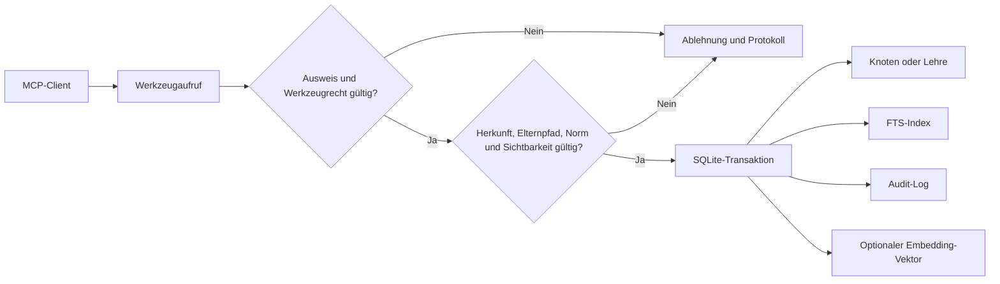
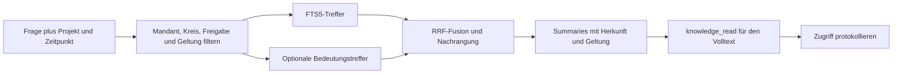

# Brainlehr

> **Public Alpha.** Dieses Repository ist die datenfreie, öffentliche Ausgabe. Es enthält den portablen Kern, nicht den privaten Betriebsbestand.

Brainlehr ist ein lokaler Wissensspeicher für KI-Agenten. Er verbindet SQLite/FTS5, optionale lokale Einbettungen und eine MCP-Schnittstelle über Standard-Ein-/Ausgabe. Herkunft, Geltung und Sichtbarkeit sind Felder mit technischen Schranken — keine bloßen Schreibregeln für das Modell.

## Was brainlehr kann

| Bereich | Fähigkeiten |
|---|---|
| Wissen | Hierarchische Knoten lesen, suchen, anlegen und aktualisieren; jeder neue Knoten braucht eine Herkunft. |
| Regeln und Geltung | Fakten von befristeten oder unbefristeten Normen trennen, Rang und Geltungszeit prüfen, Konflikte sichtbar machen. |
| Suche | FTS5-Volltext und optional lokale Embeddings zusammenführen; nach Projekt, Entstehungszeit, Geltung und eigenem Wissen oder Nachschlagewerken filtern. |
| Beziehungen | Explizite, typisierte Kanten mit Beleg anlegen, lesen, ändern und entfernen; keine aus Text oder Tags erfundenen Verbindungen. |
| Unsicherheit | Annahmen mit Belegrang und Irrtumskosten offen halten, später belegen oder widerlegen. |
| Lernen | Fehler, Einsichten und Muster als Lehren speichern, Wiederholungen zählen und wiederkehrende Lehren zu Regeln eskalieren. |
| Schutz | Mandant, Kreis, Ausweis und Werkzeugrechte durchsetzen; Einträge freigeben, sperren oder nachvollziehbar zurückziehen. |
| Nachvollziehbarkeit | Zugriffe und Schreibvorgänge protokollieren, Auditkettenbrüche begründet erklären und Vertrauenswert aus beobachteter Nutzung berechnen. |
| Betrieb | Einzelplatz- oder Unternehmensprofil einrichten, Kataloge getrennt importieren, Sitzungs-Checkpoints führen, Statistik abrufen und den Kurator zuerst als Dry-Run ausführen. |
| Integrationen | MCP für beliebige lokale Clients; Vorlagen für Claude, ChatGPT und Hermes; agentneutrale Prompt-Invarianz für Bewertungen und Entscheidungen. |

Eine aktuelle Public-Alpha-Grenze wird nicht versteckt: `knowledge_selbstauskunft` ist registriert, aber in diesem Export fehlt noch `kern/selbstauskunft.py`; dieses einzelne Werkzeug ist daher derzeit nicht ausführbar.

## Zwei Kernabläufe

### Schreiben: Wissen wird nur hinter den Schranken dauerhaft



### Abrufen: erst filtern, dann rangieren, dann gezielt lesen



## Schnellstart

Brainlehr benötigt Python 3.11 oder neuer.

```sh
git clone https://github.com/3lehr/brainlehr.git
cd brainlehr
python3.11 schnellstart.py
python3.11 knowledge_mcp_server.py
```

`schnellstart.py` erstellt eine lokale Beispieldatenbank. Diese Datei ist absichtlich nicht versioniert.

Für Claude: `integrations/claude/settings.template.json` mit eigenen lokalen Pfaden kopieren; die Hook-Vorlagen liegen unter `integrations/claude/hooks/`.

Für ChatGPT bleibt derselbe stdio-MCP lokal. Der [offizielle Secure-MCP-Tunnel](integrations/chatgpt/README.md) stellt den authentifizierten HTTPS-Transport bereit und exponiert im Profil `prompt-invariance` ausschließlich die beiden Vergleichswerkzeuge. Hermes kann die beiliegende [Konfigurationsvorlage](integrations/hermes/config.template.yaml) nutzen; der automatische Memory-Provider lebt im eigenen Repository [`hermes-brainlehr`](https://github.com/3lehr/hermes-brainlehr).

Prompt-Invarianz wird nur für Bewertungen, Rangfolgen und Entscheidungen aktiviert: normal `light`, bei gemeinsamen, irreversiblen, sicherheits-, Datenmodell- oder Automationsfolgen `strong`. Faktensuche, Extraktion, Ausführung und Tests bleiben `off`.

## Daten bleiben lokal

Dieses Repository enthält keinen Betriebsbestand und keinen Wissensexport. Datenbanken, Logs, Sicherungen, private Client-Einstellungen sowie Wissen über Personen, Projekte, Orte oder Betriebsereignisse bleiben außerhalb des Git-Repositories. Neue Einträge sind im Speicher standardmäßig `intern`; eine Freigabe ist eine eigene, protokollierte Entscheidung.

## Entwicklung

```sh
python3.11 -m pytest -q -p no:cacheprovider tests
python3.11 tools/privacy_check.py
```

Der Privacy-Check ist ein technischer Schutz, keine DSGVO- oder Compliance-Zusage.

## Lizenz

**AGPL-3.0.** Wer die Software als Dienst betreibt, legt seinen Quelltext ebenfalls unter der AGPLv3 offen. Der Wortlaut steht in [LICENSE](LICENSE), der Beitragsablauf samt CLA in [CONTRIBUTING.md](CONTRIBUTING.md).

Vom 17. bis 20. August 2026 trug das öffentliche Repository irrtümlich MIT. Eine damals bereits erteilte Erlaubnis lässt sich nicht rückwirkend entziehen. Die Lizenzangaben zum Fremdmaterial sind davon unberührt.
