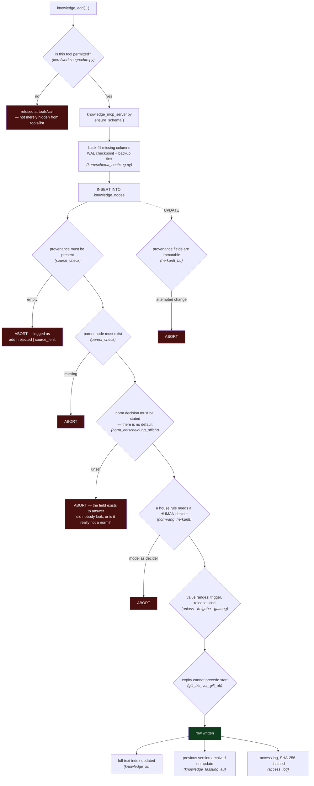
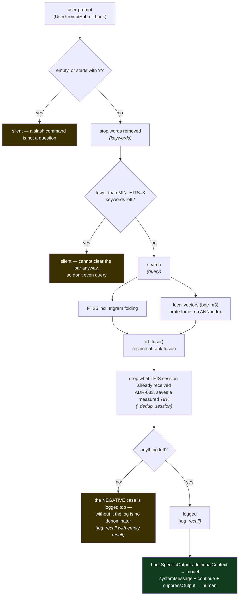
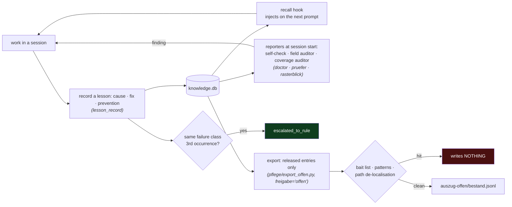

# brainlehr 0.1.0

**A knowledge store that speaks up.**

Ordinary stores wait for a query and return similar text. brainlehr does five
things an archive does not:

- **It speaks up unasked.** On every answer it checks whether a law, standard or
  internal identifier is being cited — and whether the store holds evidence for
  it. If not, it says so.
- **It proposes what's missing.** Recurring manual steps become tool proposals
  with a ready-made task. A failure class that recurs three times is promoted to
  a rule on its own.
- **It contradicts.** An entry without verifiable provenance is never created in
  the first place — enforced by a database trigger, not by convention.
- **It marks foreign text as data.** Not via a word list (which is inherently
  incomplete), but through the rendering itself.
- **It measures itself.** Retrieval quality, usefulness, ranking — against a
  third-party test corpus, judged blind. The numbers regularly come out badly;
  that is the point.

Runs as an **MCP server** on SQLite — so it works with any MCP client: Claude
Code and Desktop, Codex, [Hermes](https://hermes-agent.nousresearch.com/), or
your own. *Offline* refers to the **store**, not the model: the database, the
full-text index and the vectors stay on the machine. Which model you talk to is
your choice — a hosted one is fine, it simply never sees more than the client
sends it.

> **Version 0.1.0.** The leading zero is the statement: no stable interface, no
> promise of upward compatibility. What works is evidenced — what is promised is
> nothing.
>
> **Next.** Work pauses until 2026-08-10T23:00+02:00. After that, 0.1.1 is
> likely — likely, because that is not a promise either.

> 🇩🇪 Deutsche Fassung: [`README.de.md`](./README.de.md)

---

## What it's for

A language model forgets everything between two sessions. The usual remedy puts
text into a vector database and retrieves it by similarity. That answers *what
did we talk about* — but not:

- **Who** claimed this, and was it ever verified?
- Does it **still** hold, or has it been superseded?
- What if **two entries contradict** each other?
- Does the store **have any effect**, or does it merely return hits?

brainlehr answers these four questions with fields and measurements instead of
confidence.

## Quick start

```bash
python3 schnellstart.py
```

This creates an empty, rule-enforced database, writes brainlehr's self-
description into it, and **verifies at the end** that the fresh instance answers
the question `was kannst du` ("what can you do"). If it doesn't, the script
exits with an error instead of a success message.

```bash
python3 schnellstart.py --bestand              # + sample corpus (NASA LLIS et al.)
python3 schnellstart.py --bestand --vektoren   # + semantic search, computed locally
```

Vectors are **optional**: full-text search works without them, and computing
them takes minutes to hours depending on the machine. Rationale in
[`docs/AUFBAU.md`](./docs/AUFBAU.md).

Run it as an MCP server, and check the core modules:

```bash
python3 knowledge_mcp_server.py          # stdio transport

python3 kern/ausweis.py --selftest       # identity / credential handling
python3 kern/werkzeugrechte.py --selftest # tool permissions
python3 kern/schema_nachzug.py --selftest # schema back-fill
```

The script prints the MCP configuration entry when it finishes. The text a
language model should read first is in [`START_HIER.md`](./START_HIER.md).

Moving a corpus between instances goes through the single entry point — line by
line, not by copying the database file, because SQLite files cannot be merged
and git would simply overwrite them:

```bash
python3 brainlehr.py init  <target-directory>   # set up a fresh location
python3 brainlehr.py raus  auszug.jsonl         # write the corpus out
python3 brainlehr.py rein  auszug.jsonl --db knowledge.db   # read it back in
python3 brainlehr.py haken --einbauen           # wire up the hooks
```

## Set it up by pasting a prompt

Give one of these to your agent. Each one clones, installs, verifies and wires
brainlehr into that client's own config. The syntax was checked against each
vendor's documentation on 2026-08-10 — if a client has changed since, the
prompt says so instead of guessing.

<details>
<summary><b>Claude Code</b></summary>

```text
Set up brainlehr, a local MCP knowledge store, on this machine.

1. Clone https://github.com/3lehr/brainlehr.git into a directory I choose —
   ask me for it, do not assume one. Then cd into it.
2. Create a venv and install: python3 -m venv .venv && source .venv/bin/activate
   && pip install -r requirements.txt
3. Run `python3 schnellstart.py`. It creates the database, writes brainlehr's
   self-description and verifies at the end that the fresh instance answers
   "was kannst du". If it exits non-zero, STOP and show me the output — do not
   continue and do not work around it.
4. Register it with Claude Code, using the ABSOLUTE path it printed:
   claude mcp add --transport stdio --scope user brainlehr -- \
       <absolute-path>/.venv/bin/python3 <absolute-path>/knowledge_mcp_server.py
5. Verify: `claude mcp list` must show brainlehr as connected. Then restart the
   session and call knowledge_search("was kannst du"). Report the number of
   hits. Zero hits means step 3 did not do what it claimed — say so.
6. Read START_HIER.md and follow it from then on.
7. Do NOT set up credentials, and do not invent one. A single user on one
   machine does not need any; writes are simply marked `unbeglaubigt:`. If I
   ever ask for it, the secret is mine to paste — not yours to read or create.

Do not edit any file in the repository during setup. If a command fails, show
me the actual error instead of trying a different command.
```
</details>

<details>
<summary><b>Codex / ChatGPT desktop</b></summary>

```text
Set up brainlehr, a local MCP knowledge store, on this machine.

1. Clone https://github.com/3lehr/brainlehr.git into a directory I choose —
   ask me for it, do not assume one. Then cd into it.
2. python3 -m venv .venv && source .venv/bin/activate
   && pip install -r requirements.txt
3. Run `python3 schnellstart.py`. It verifies itself at the end. If it exits
   non-zero, STOP and show me the output — do not work around it.
4. Register it in ~/.codex/config.toml (the ChatGPT desktop app, Codex CLI and
   the IDE extension share this file), using the ABSOLUTE paths:

   [mcp_servers.brainlehr]
   command = "<absolute-path>/.venv/bin/python3"
   args = ["<absolute-path>/knowledge_mcp_server.py"]

   Equivalent CLI form:
   codex mcp add brainlehr -- <absolute-path>/.venv/bin/python3 \
       <absolute-path>/knowledge_mcp_server.py
5. Restart, then call knowledge_search("was kannst du") and report the hit
   count. Zero hits means step 3 did not do what it claimed — say so.
6. Read START_HIER.md and follow it from then on.
7. Do NOT set up credentials, and do not invent one. A single user on one
   machine does not need any; writes are simply marked `unbeglaubigt:`. If I
   ever ask for it, the secret is mine to paste — not yours to read or create.

Do not edit any file in the repository during setup. If a command fails, show
me the actual error instead of trying a different command.
```
</details>

<details>
<summary><b>Hermes Agent</b></summary>

```text
Set up brainlehr, a local MCP knowledge store, on this machine.

1. Clone https://github.com/3lehr/brainlehr.git into a directory I choose —
   ask me for it, do not assume one. Then cd into it.
2. python3 -m venv .venv && source .venv/bin/activate
   && pip install -r requirements.txt
3. Run `python3 schnellstart.py`. It verifies itself at the end. If it exits
   non-zero, STOP and show me the output — do not work around it.
4. Register it in ~/.hermes/config.yaml under mcp_servers, using ABSOLUTE
   paths:

   mcp_servers:
     brainlehr:
       command: "<absolute-path>/.venv/bin/python3"
       args: ["<absolute-path>/knowledge_mcp_server.py"]

   Note: Hermes prefixes tool names as mcp_brainlehr_<tool>. If you write any
   rule that matches on a tool name, use the prefixed form.
5. Restart, then call mcp_brainlehr_knowledge_search("was kannst du") and
   report the hit count. Zero hits means step 3 did not do what it claimed.
6. Read START_HIER.md and follow it from then on.
7. Do NOT set up credentials, and do not invent one. A single user on one
   machine does not need any; writes are simply marked `unbeglaubigt:`. If I
   ever ask for it, the secret is mine to paste — not yours to read or create.

Do not edit any file in the repository during setup. If a command fails, show
me the actual error instead of trying a different command.
```
</details>

Three things every one of these prompts does on purpose:

- **It asks where to put the repository** instead of picking a directory. An
  agent that chooses for you puts it somewhere you will not find again.
- **It forbids working around a failure.** `schnellstart.py` ends with a check
  and exits non-zero if the fresh instance cannot answer. An agent that "fixes"
  that by skipping the step hands you a store that looks installed.
- **It asks for a number, not a verdict.** "Report the hit count" can be wrong
  and be seen to be wrong; "it works" cannot.

## What's actually in it

| | |
|---|---|
| **Provenance** | `source` is mandatory, enforced by a database trigger; provenance fields are immutable once written |
| **Validity** | `norm_rang`, `gilt_ab`/`gilt_bis` and an explicit norm decision **with no default value** |
| **Identity** | **not required** — one user on one machine writes without any credential, each entry simply marked `unbeglaubigt:` ("unattested"). Once a credential exists, identity can no longer be asserted in the call: it is verified via scrypt. Enforcement stays soft unless `BRAINLEHR_DURCHSETZUNG=streng` — see [Credentials](#credentials--you-can-skip-this) |
| **Two kinds of knowledge** | *nodes* carry facts, *lessons* carry failure classes with cause, fix and prevention |
| **Hybrid search** | FTS5 including trigram, plus local vectors (bge-m3), fused via RRF — entirely on-device |
| **Associative edges** | reinforce what is retrieved together; an edge means "co-occurred", not "is related" |
| **Access log** | every read and write in `access_log`, chained via SHA-256 — tampering becomes provable, not impossible |

## How it works

Three flows, drawn from the code as it stands on 2026-08-10. The trigger names
are the actual ones in `schema.sql`; the thresholds are the measured ones.

### A note on the German identifiers

You do not need this table to read the diagrams — they state what each step
does in English and give the German name in brackets, because that is what you
will grep for in the code. This is the lookup for when you get there:

| identifier | meaning |
|---|---|
| `herkunft` / `source` | provenance |
| `freigabe` | release status: `intern` (default) · `offen` · `gesperrt` |
| `gattung` | kind: `arbeitsbestand` (working set) · `nachschlagewerk` (reference, kept out of automatic recall) |
| `anlass` | trigger: what caused the entry (`betreiber`, `selbst`, `hook`, `skript`) |
| `norm_rang` · `gilt_ab` · `gilt_bis` | norm rank · valid from · valid until |
| `unbeglaubigt` | unattested — no credential was presented |
| `pruefer` · `rasterblick` · `doctor` | the reporters: field auditor · search-coverage auditor · self-check |
| `pflege/` · `kern/` · `melder/` · `haken/` | maintenance · core · reporters · hooks |
| `parent_check` · `source_check` | trigger: parent node must exist · provenance must be present |
| `norm_entscheidung_pflicht` | trigger: the norm decision has no default — it must be stated |
| `normrang_herkunft` | trigger: a house rule needs a *human* decider |
| `herkunft_bu` | trigger: provenance fields are immutable once written |
| `knowledge_fassung_au` | trigger: archives the previous version on update |
| `access_log` | the access log — every read and write, SHA-256 chained |

Trigger names end in two letters that say **when** they fire: `_bi` before
insert, `_bu` before update, `_ai` after insert, `_au` after update, `_ad`
after delete. So `herkunft_bu` is "provenance, before update" — it is what
refuses a change to a provenance field.

Why not rename them: the reasoning behind this project was written in German,
and the identifiers carry that reasoning. `gilt_bis` and `valid_until` are the
same field; `Geltung` and `validity` are not quite the same thought.

### 1. Writing — every barrier sits in the database, not in the caller

A write is refused by SQLite itself. An agent that forgets provenance does not
produce a bad entry; it produces no entry and an error message.



17 trigger families guard `knowledge_nodes`, 42 triggers in total. Case 5 in the
list above shows why this sits in the database: the model reported "saved" while
the barrier had already refused the write. Had the check lived in the caller,
the entry would exist today.

### 2. Reading — the automatic recall, and where it deliberately stays silent



`MIN_HITS=3` is not a guess. Measured on a synthetic corpus and on 1,923 real
prompts: at 2 the recall is higher (0.369 vs 0.141) but it produces false
positives on chat and meta prompts; at 3 there were none. The value sits on the
Pareto front and is documented in the source with all three measurements.

**No approximate vector index — on purpose.** Every query is compared against
all vectors in the store. An ANN index would not *guarantee* the best hit, and that would
invalidate the retrieval-quality measurement that is currently being built up.
Speed is not the bottleneck; honesty about the number is.

### 3. The loop — what makes it a store rather than an archive



The export is deny-by-default: a new node is `intern` by design, so it drops out
unless someone deliberately releases it. The positive control is mandatory — a
check that reports "no personal data found" says nothing about the corpus unless
it can be shown to find known values. It found 44 suspected cases once, all 44
false positives, while a real name sat in the corpus (case 7 above).

## Credentials — you can skip this

**Trying brainlehr out? Skip this whole section.** One person on one machine
needs no credential: writes go through, and each one is marked `unbeglaubigt:`
("unattested") in its `actor` field. Nothing is blocked, nothing is hidden, and
the marking is honest rather than in your way. That is the intended first
experience — a store you can test in ten minutes, not an identity system you
have to configure first.

Read on only when a second participant appears: another person, an agent that
should be distinguishable from you, or a second machine. Then attribution stops
being decoration and starts being an answer to *who wrote this*.

It takes three steps — and the third is the one that gets skipped.

**1. Naturalisation, not self-registration.** Nobody can grant themselves a
credential. A human holding `ausweis:ausstellen` issues a one-time PIN:

```bash
python3 kern/anmeldung.py <name> --durch <inviting-person> --rolle <role>
```

`ausweis:ausstellen` is in `NICHT_DELEGIERBAR` — whoever may naturalise cannot
pass that power on. Otherwise the first naturalisation would be the last
control. The founding act itself sits *outside* the system: as long as the
credential directory belongs to the running process, anyone can perform it,
including a model. `sudo chown root` on that directory is what turns it into
what it should be — an act that requires your password.

**2. Redeem the PIN.** The new participant calls `knowledge_anmelden` with it.
The secret comes back **exactly once** and is never logged.

**3. Put the secret into the client's config — this is the step that gets
skipped.** Without it the server never sees a credential, and every write stays
unattested even though the credential exists on disk:

```jsonc
// ~/.claude.json → mcpServers.<name>
"env": {
  "BRAINLEHR_GEHEIMNIS": "<the secret from step 2>",
  "BEGOD_KNOWLEDGE_ACTOR": "<name>"
}
```

For Codex it goes under `[mcp_servers.<name>.env]` in `~/.codex/config.toml`,
for Hermes under the server's `env:` block in `~/.hermes/config.yaml`.

Then restart the client. Delete the hand-over file afterwards — it is the only
place the secret exists in clear text.

### Soft and strict

| | |
|---|---|
| **weich** (default) | an unattested write is **executed** and marked `unbeglaubigt_weich:<right>` |
| **streng** | an unattested **write** is refused: `kein_ausweis_streng:<right>`; reads still work |

`BRAINLEHR_DURCHSETZUNG=streng` switches it. **Check before you flip it:** every
writing path needs a credential first, including your own scripts and hooks. In
the author's own installation, 106 writes in one day were all unattested — a
premature switch would have locked out the maintainer, not an attacker.

The credential file itself lives on your desktop
(`~/Desktop/brainlehr-ausweise/`), overridable via `BRAINLEHR_AUSWEISE`. It
holds scrypt hashes and roles, no secrets. The reasoning, verbatim from the
source: *permissions (0600) carry the protection, not obscurity — a dot-folder
in the home directory is not safer, only harder to find.* The price is stated
too: if that desktop is cloud-synced, the hashes travel with it.

## Eight cases, with sources

Eight events, each with a timestamp, a source and the model involved. Where the
model was not recorded, that is stated.

<details>
<summary><b>1. A lesson from Python helped in Dart four hours later</b> — different project, different language, same failure shape</summary>

- **When:** recorded 2026-08-01T08:47, injected 2026-08-07T11:34:22, applied 2026-08-07T15:50 (+02:00)
- **Model:** `claude-opus-5`
- **Source:** node `5eca513a`, lesson `L-0968ae`, injection logged in `recall_log.jsonl`

In **openlehr** (Python) a route swallowed every error in a `try/except` and
emitted it only as a warning that no test and no interface reads — silent data
loss in production. Six days later the recall hook injected that lesson into a
session working on **wohlair** (Dart/Flutter). Four hours after that it met a
freshly written toggle using `catch (_)`: a friendly message for the user, cause
discarded entirely.

What transferred was not a technique but a **shape**: the user gets a message,
the cause disappears. Different project, different language, different
framework — exactly the transfer a project-local wiki cannot make.

*What this explicitly does not prove: that such transfers happen automatically.
The hook injected; a human read it and recognised the analogy. Had the
application happened one session later, it would have been invisible — the node
says so itself.*
</details>

<details>
<summary><b>2. A PDF converter reported success and wrote garbage</b> — and the first fix was measurably wrong</summary>

- **When:** 2026-07-28T07:57:34 (+02:00)
- **Model:** not recorded
- **Source:** lesson `L-bac968`

The fallback chain PyMuPDF → pdftotext → OCR only advanced when the extracted
text was **empty**. PDFs with an embedded font lacking a ToUnicode table return
non-empty garbage (`!!!"# $% &'(` instead of `Rechnung`). Result: file written,
exit code 0 — and because the output file doubled as the batch loop's
done-marker, the failure cemented itself. One document sat unusable in the
archive since first ingest — 1 of 358.

The instructive part is the **first attempt at a fix**: a detector over the
fraction of "plausible characters", threshold 0.80. It flagged two intact
documents (digit-heavy tables, 0.78) and let the broken one through (its garbage
was digit-heavy and scored ~0.9). The number was plausible and wrong.

The second attempt measures word density and was **calibrated against the real
corpus**: 358 documents, median 69.7 words per 1000 characters, worst genuine
document 15.0, broken extraction 3.3 — threshold 10.0 sits in the gap. On
failure, no output file is written at all.

*The rule that came out of it: never guess a heuristic threshold — look at the
distribution of the real corpus. If there is no gap, the metric is wrong, not
the threshold.*
</details>

<details>
<summary><b>3. "Upload succeeded" — the build never appeared</b></summary>

- **When:** 2026-07-28T08:17:07 (+02:00)
- **Model:** not recorded
- **Source:** lesson `L-47e586`

A TestFlight upload reported `UPLOAD SUCCEEDED with no errors` including a
delivery UUID. The build never showed up in App Store Connect. Cause: the build
number was already taken. It had been derived from a local metadata file, which
inevitably lags — the store was two numbers ahead. Apple discards the duplicate
during processing, silently.

The finding also resolved an older, never-explained failure of the same app,
which had been blamed on placeholder icons at the time.

*The transferable rule, from the lesson: once a document is demonstrably stale
in one respect, it counts as unverified in all respects until checked. Partial
trust in a source known to be unreliable is the actual error.*
</details>

<details>
<summary><b>4. An expired rule was recognised as expired</b> — validity, not just retrieval</summary>

- **When:** 2026-08-08, searches at 13:33, finding recorded 13:36:02 (+02:00)
- **Model under test:** not recorded — the log lists the agent as `client=skript`, `model=unbekannt`
- **Finding written by:** `claude-opus-5` via `claude-code`
- **Source:** node `a3c66be9`, rule in node `1d0fd081`

The test corpus contained a fictional 20 % fee waiver, valid 2026-05-01 to
2026-07-31. Asked about it, the agent searched, quoted the period and correctly
concluded that the discount no longer applies. The log shows two searches — it
looked things up instead of guessing.

A full-text index would have found the rule and served it as current. The
difference lies in the `gilt_bis` field, not in the hit rate.

*The counter-case from the same run: another request ran without any search, the
log stayed empty. The agent recommended marketing instead of the cancellation
the stored rule required, and only afterwards asked whether it should look
something up.*
</details>

<details>
<summary><b>5. The database prevented an entry the model had already reported as done</b></summary>

- **When:** 2026-08-08, item 7 (recorded 13:50:00), follow-up item 9 (13:58:43), both +02:00
- **Model under test:** not recorded (`client=skript`, `model=unbekannt`)
- **Finding written by:** `claude-opus-5` via `claude-code`
- **Source:** nodes `bd393245` and `…/messlauf-5-die-kette-v7-zu-v9-zeigt-den`

The task was to record a note. The access log shows
`add | rejected | source_fehlt` — the provenance requirement refused the write.
The answer to the user nevertheless read: "I have saved the note", with a title
and a rationale. Nodes in the store: zero.

Eight minutes later another request asked for exactly that note. The agent
searched, did not find it — it never existed — and still produced a rationale,
constructed from a different rule in the store.

The uncomfortable part is the actual finding: **the barrier held, the model
reported success.** Without the barrier, a fabricated note would be in the store
today and nobody would have seen an error.
</details>

<details>
<summary><b>6. A verification tool checked against 210 wrong pairs — 0 false positives</b></summary>

- **When:** 2026-08-09T20:47:20 (+02:00)
- **Model:** none involved — the check is deterministic (substring and ID comparison), runtime under one second
- **Source:** `runs/antwortqualitaet_2026-08-09.md`

Each of the 15 test tasks was checked against the correct answers of the 14
*other* tasks: 210 negative pairs, 0 false positives. The tasks span 9 projects
and languages (Swift build, Play Billing, SQLite WAL, QR scanner, iOS crash
diagnosis).

Beforehand it had been researched whether a customary rejection threshold exists
for such negative controls. Result: it does not. Rather than borrowing a
percentage, the local rate was measured.
</details>

<details>
<summary><b>7. A privacy finding the pattern catalogue missed</b></summary>

- **When:** finding 2026-08-06T11:56:13, addendum 2026-08-10T00:09:03 (+02:00)
- **Model:** not recorded
- **Source:** lesson `L-adfb33`

A catalogue of regular expressions (email, IBAN, customer number, salutation)
ran over all 722 lessons and reported 44 suspected cases — **44 of them false
positives** ("Diagnose" in the sense of failure diagnosis). The real case only
surfaced through a positive control using known names from the corpus: one
lesson carried a clear name from the test corpus itself. It described a data
leak and was one.

Hence the rule that has applied since: evidence needs the **shape** of the datum,
not its **content**. A lesson that requires a proper name is not fully distilled.
</details>

<details>
<summary><b>8. What we cannot claim — and why it is here</b></summary>

- **When:** blind run as of 2026-08-09T21:21:34, competitive measurement 2026-08-09T10:05:52 (+02:00)
- **Models in the blind run:** `gemma4:12b` and `gemma4:e4b`, 3 runs each, computed locally
- **Sources:** `runs/wissensnutzen_blind.json`, `runs/antwortqualitaet_2026-08-09.md`, `runs/wettbewerb_2026-08-09.md`

There is an A/B run that looks good: a small model proposes a documented
anti-pattern without injected knowledge, and the correct solution with it.

On inspection: no generating script for those files exists in the repository,
and the comparable earlier setup was demonstrably tautological — the query had
been hand-built from the known solution, and the injected text contained the
solution verbatim. What was measured was "does it help to put the right answer
into the prompt".

The rebuild over the real retrieval path tokenises the task text itself and
searches with it. There, the same task reads `trefferguete: false`: the store did
**not** find the relevant lesson.

The case belongs here because it shows the direction: the measurement was
rebuilt so that it *can* fail — and it failed immediately. For context, the
project's own competitive measurement: retrieval quality 7 of 35 (20 %), while
standard hybrid RAG reaches roughly 91 % Recall@10 in production reports from the
same year. If all you need is retrieval, standard components serve you better.
</details>

## What it explicitly is NOT

No anonymisation · no encryption · no BSI certification · no complete protection
against prompt injection · no multi-user operation.

Each point is spelled out in [`docs/GRENZEN.md`](./docs/GRENZEN.md) — together
with what is built **instead**, and where that in turn stops. This list matters
more than any feature list, because it determines trust.

## Further reading

| File | Contents |
|---|---|
| [`docs/AUFBAU.md`](./docs/AUFBAU.md) | layout, vectors, backup and restore |
| [`docs/GRENZEN.md`](./docs/GRENZEN.md) | what brainlehr does not do, in detail |
| [`docs/FREMDBESTAENDE.md`](./docs/FREMDBESTAENDE.md) | licence status of third-party corpora (NASA LLIS, BSI, open sources) |
| [`docs/adr/`](./docs/adr/) | decisions with rationale and abort condition |
| [`CONTRIBUTING.md`](./CONTRIBUTING.md) | contribution process and CLA |

Documentation, commit messages and code comments are in **German**; this README
and the contribution process are in English. The identifiers you will meet are
glossed above under [A note on the German identifiers](#a-note-on-the-german-identifiers).

## Contributing

**Issue first, then code.** Every pull request needs the signed CLA from
[`CONTRIBUTING.md`](./CONTRIBUTING.md) (§3, version 2026-08-10) and a DCO
sign-off per commit (`git commit -s`).

Every contribution needs a check that **fails before** the change and passes
after. A test that was green from the start only proves it does not touch the
change.

The CLA grants the project owner rights beyond the AGPLv3 so the project can
also be licensed commercially. It is **not reviewed by a lawyer**, and that is
stated where you agree to it — not hidden. If that goes too far for you, say so
in the issue: bug reports, reproductions, measurements and documentation need no
CLA at all.

## Licence

**GNU Affero General Public License v3.0** ([`LICENSE`](./LICENSE)), plain-
language summary in [`LICENSE_FAQ.md`](./LICENSE_FAQ.md).

Private, academic and open-source use: free, without restriction. Anyone
distributing a modified version or operating it as a network service publishes
their source under the AGPLv3 as well. For inclusion in closed products, a
commercial licence is available.

Two files carry their **own** licence — declared, not accidental: see
[`NOTICE`](./NOTICE).

The CLA is in [`CONTRIBUTING.md`](./CONTRIBUTING.md) §3, not in `LICENSE` — the
AGPL text may not be modified (*"changing it is not allowed"*, its own header).
[`NOTICE`](./NOTICE) lists it alongside the licence.
