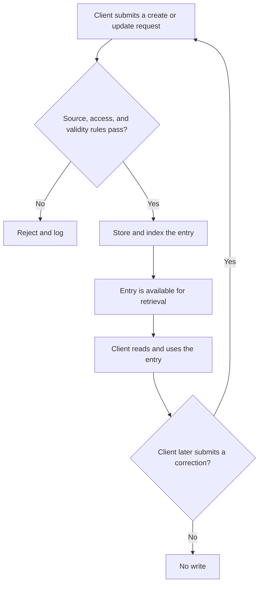
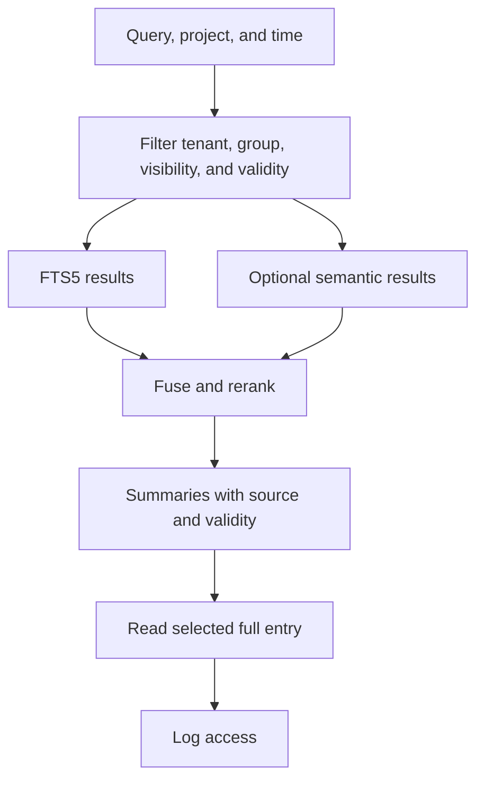

# Brainlehr

> **Public alpha.** This repository is the portable, data-free edition of Brainlehr. It contains the software, not a private knowledge store.

Brainlehr is a local knowledge store for AI agents. It combines SQLite/FTS5, optional local embeddings, and a stdio MCP server. Provenance, validity, visibility, and access rules are enforced by the store instead of relying on prompt instructions alone.

## Capabilities

| Area | What Brainlehr provides |
|---|---|
| Knowledge | Read, search, create, and update hierarchical knowledge nodes. Every new node requires a source. |
| Rules and validity | Distinguish facts from temporary or permanent rules, apply precedence and validity windows, and surface conflicts. |
| Retrieval | Combine FTS5 full-text search with optional local embeddings; filter by project, creation time, validity, and corpus type. |
| Relationships | Store explicit, typed, sourced relationships without inferring links from prose or tags. |
| Uncertainty | Track assumptions with evidence strength and the cost of being wrong, then confirm or reject them later. |
| Learning | Record errors, insights, and patterns; count repetitions and escalate recurring lessons into rules. |
| Access control | Enforce tenant, group, credential, and tool permissions; release, block, or withdraw entries with an audit trail. |
| Traceability | Log reads and writes, explain sanctioned audit-chain breaks, and calculate trust from observed use. |
| Operations | Configure single-user or organization profiles, import reference catalogs separately, manage session checkpoints, inspect statistics, and run the curator in dry-run mode. |
| Integrations | Connect local MCP clients and use templates for Claude, ChatGPT, and Hermes. Prompt-invariance tools support evaluations, rankings, and decisions. |

## How it works

### Explicit knowledge maintenance

Brainlehr validates every write. A later correction returns through the same path only when a client submits a new update request.



Reading an entry logs access and increments its access count. It does not confirm, refresh, or rewrite the entry.

### Filtered retrieval



## Quick start

Brainlehr requires Python 3.11 or newer.

```sh
git clone https://github.com/3lehr/brainlehr.git
cd brainlehr
python3.11 schnellstart.py
python3.11 knowledge_mcp_server.py
```

`schnellstart.py` creates a local example database. The database is intentionally excluded from Git.

## Client integrations

- **Claude:** copy `integrations/claude/settings.template.json` and replace its paths with local paths. Hook templates are available in `integrations/claude/hooks/`.
- **ChatGPT:** use the [Secure MCP tunnel](integrations/chatgpt/README.md) to expose the local stdio server over authenticated HTTPS. Its `prompt-invariance` profile exposes only the two comparison tools.
- **Hermes:** start from `integrations/hermes/config.template.yaml`, or use the automatic memory provider in [`hermes-brainlehr`](https://github.com/3lehr/hermes-brainlehr).

Prompt invariance is intended for evaluations, rankings, and decisions. The planning tool selects `light` for ordinary comparisons and `strong` when a decision is shared, irreversible, security-sensitive, changes the data model, or triggers automatic actions. Search, extraction, execution, and tests remain `off`.

## Local data and privacy

This repository contains no operational knowledge store or knowledge export. Databases, logs, backups, private client settings, and knowledge about people, projects, places, or operational events stay outside Git. New entries default to `intern`; releasing an entry is a separate, logged action.

## Known limitation

The public alpha registers `knowledge_selbstauskunft`, but this export does not yet include `kern/selbstauskunft.py`, so that tool is unavailable.

## Contributing

See [CONTRIBUTING.md](CONTRIBUTING.md) for the development workflow, checks, sign-off, and contributor license agreement.

## License

Brainlehr is licensed under the **GNU Affero General Public License v3.0 or later (AGPL-3.0-or-later)**. See [LICENSE](LICENSE).
