# Verbundkarte

**Erzeugt von `melder/verbundkarte.py` -- nicht von Hand aendern.**
Kein Zeitstempel: das Erzeugnis soll sich nur aendern, wenn sich die
Architektur aendert. Wann es entstand, sagt `git log -- docs/VERBUNDKARTE.md`.

```mermaid
graph LR
  port_1234(["Port 1234 (fremd)"])
  _brainlehr_open -->|ruft| port_1234
  _probe_head -->|ruft| port_1234
  brainlehr -->|ruft| port_1234
  hub -->|ruft| port_1234
  openlehr_legacy -->|ruft| port_1234
  stiftshuette -->|ruft| port_1234
  port_2026(["Port 2026"])
  fahrtenbuch -->|lauscht| port_2026
  class port_2026 waise
  port_4141(["Port 4141 (fremd)"])
  openlehr_legacy -->|ruft| port_4141
  openlehr_stale_2026_07_22 -->|ruft| port_4141
  snake -->|ruft| port_4141
  port_4242(["Port 4242"])
  legacylink -->|lauscht| port_4242
  openlehr_legacy -->|lauscht| port_4242
  openlehr_stale_2026_07_22 -->|lauscht| port_4242
  snake -->|lauscht| port_4242
  port_4243(["Port 4243 (fremd)"])
  openlehr_legacy -->|ruft| port_4243
  openlehr_stale_2026_07_22 -->|ruft| port_4243
  snake -->|ruft| port_4243
  port_5005(["Port 5005 (fremd)"])
  openlehr_legacy -->|ruft| port_5005
  openlehr_stale_2026_07_22 -->|ruft| port_5005
  snake -->|ruft| port_5005
  port_5601(["Port 5601 (fremd)"])
  UsbKabelTester -->|ruft| port_5601
  afrika -->|ruft| port_5601
  buckeberg -->|ruft| port_5601
  design_lab -->|ruft| port_5601
  drg -->|ruft| port_5601
  drobo_nas -->|ruft| port_5601
  fahrtenbuch -->|ruft| port_5601
  hub -->|ruft| port_5601
  legacylink -->|ruft| port_5601
  markusx25 -->|ruft| port_5601
  openhood -->|ruft| port_5601
  openlehr_legacy -->|ruft| port_5601
  openlehr_stale_2026_07_22 -->|ruft| port_5601
  pflegelotse -->|ruft| port_5601
  phoenix -->|ruft| port_5601
  schwarmwacht -->|ruft| port_5601
  snake -->|ruft| port_5601
  steueroase_asien -->|ruft| port_5601
  stiftshuette -->|ruft| port_5601
  wpdrop -->|ruft| port_5601
  port_7331(["Port 7331"])
  buckeberg -->|lauscht| port_7331
  design_lab -->|lauscht| port_7331
  drobo_nas -->|lauscht| port_7331
  fahrtenbuch -->|lauscht| port_7331
  hub -->|lauscht| port_7331
  openlehr_legacy -->|lauscht| port_7331
  openlehr_stale_2026_07_22 -->|lauscht| port_7331
  schwarmwacht -->|lauscht| port_7331
  snake -->|lauscht| port_7331
  steueroase_asien -->|lauscht| port_7331
  stiftshuette -->|lauscht| port_7331
  wpdrop -->|lauscht| port_7331
  port_7340(["Port 7340"])
  afrika -->|lauscht| port_7340
  class port_7340 waise
  port_7788(["Port 7788 (fremd)"])
  buckeberg -->|ruft| port_7788
  hub -->|ruft| port_7788
  openlehr_legacy -->|ruft| port_7788
  openlehr_stale_2026_07_22 -->|ruft| port_7788
  schwarmwacht -->|ruft| port_7788
  snake -->|ruft| port_7788
  steueroase_asien -->|ruft| port_7788
  stiftshuette -->|ruft| port_7788
  wpdrop -->|ruft| port_7788
  port_8000(["Port 8000 (fremd)"])
  UsbKabelTester -->|ruft| port_8000
  afrika -->|ruft| port_8000
  buckeberg -->|ruft| port_8000
  design_lab -->|ruft| port_8000
  drg -->|ruft| port_8000
  drobo_nas -->|ruft| port_8000
  fahrtenbuch -->|ruft| port_8000
  hub -->|ruft| port_8000
  legacylink -->|ruft| port_8000
  markusx25 -->|ruft| port_8000
  openhood -->|ruft| port_8000
  openlehr_legacy -->|ruft| port_8000
  openlehr_stale_2026_07_22 -->|ruft| port_8000
  pflegelotse -->|ruft| port_8000
  phoenix -->|ruft| port_8000
  schwarmwacht -->|ruft| port_8000
  snake -->|ruft| port_8000
  steueroase_asien -->|ruft| port_8000
  stiftshuette -->|ruft| port_8000
  wpdrop -->|ruft| port_8000
  port_8080(["Port 8080 (fremd)"])
  buckeberg -->|ruft| port_8080
  design_lab -->|ruft| port_8080
  drobo_nas -->|ruft| port_8080
  hub -->|ruft| port_8080
  markusx25 -->|ruft| port_8080
  openlehr_legacy -->|ruft| port_8080
  openlehr_stale_2026_07_22 -->|ruft| port_8080
  schwarmwacht -->|ruft| port_8080
  setfunk -->|ruft| port_8080
  snake -->|ruft| port_8080
  steueroase_asien -->|ruft| port_8080
  stiftshuette -->|ruft| port_8080
  wpdrop -->|ruft| port_8080
  port_8088(["Port 8088 (fremd)"])
  phoenix -->|ruft| port_8088
  wpdrop -->|ruft| port_8088
  port_8090(["Port 8090 (fremd)"])
  markusx25 -->|ruft| port_8090
  steueroase_asien -->|ruft| port_8090
  port_8091(["Port 8091"])
  steueroase_asien -->|lauscht| port_8091
  class port_8091 waise
  port_8095(["Port 8095 (fremd)"])
  phoenix -->|ruft| port_8095
  wpdrop -->|ruft| port_8095
  port_8744(["Port 8744 (fremd)"])
  buckeberg -->|ruft| port_8744
  hub -->|ruft| port_8744
  port_8765(["Port 8765"])
  buckeberg -->|lauscht| port_8765
  design_lab -->|lauscht| port_8765
  drobo_nas -->|lauscht| port_8765
  fahrtenbuch -->|lauscht| port_8765
  hub -->|lauscht| port_8765
  openlehr_legacy -->|lauscht| port_8765
  openlehr_stale_2026_07_22 -->|lauscht| port_8765
  schwarmwacht -->|lauscht| port_8765
  snake -->|lauscht| port_8765
  steueroase_asien -->|lauscht| port_8765
  stiftshuette -->|lauscht| port_8765
  wpdrop -->|lauscht| port_8765
  class port_8765 waise
  port_8787(["Port 8787 (fremd)"])
  UsbKabelTester -->|ruft| port_8787
  afrika -->|ruft| port_8787
  buckeberg -->|ruft| port_8787
  design_lab -->|ruft| port_8787
  drg -->|ruft| port_8787
  drobo_nas -->|ruft| port_8787
  fahrtenbuch -->|ruft| port_8787
  hub -->|ruft| port_8787
  legacylink -->|ruft| port_8787
  markusx25 -->|ruft| port_8787
  openhood -->|ruft| port_8787
  openlehr_legacy -->|ruft| port_8787
  openlehr_stale_2026_07_22 -->|ruft| port_8787
  pflegelotse -->|ruft| port_8787
  phoenix -->|ruft| port_8787
  schwarmwacht -->|ruft| port_8787
  snake -->|ruft| port_8787
  steueroase_asien -->|ruft| port_8787
  stiftshuette -->|ruft| port_8787
  wpdrop -->|ruft| port_8787
  port_8799(["Port 8799"])
  _brainlehr_open -->|lauscht| port_8799
  _probe_head -->|lauscht| port_8799
  brainlehr -->|lauscht| port_8799
  port_9000(["Port 9000"])
  afrika -->|lauscht| port_9000
  class port_9000 waise
  port_9100(["Port 9100"])
  fahrtenbuch -->|lauscht| port_9100
  buckeberg -->|ruft| port_9100
  design_lab -->|ruft| port_9100
  drobo_nas -->|ruft| port_9100
  hub -->|ruft| port_9100
  openlehr_legacy -->|ruft| port_9100
  openlehr_stale_2026_07_22 -->|ruft| port_9100
  schwarmwacht -->|ruft| port_9100
  snake -->|ruft| port_9100
  steueroase_asien -->|ruft| port_9100
  stiftshuette -->|ruft| port_9100
  wpdrop -->|ruft| port_9100
  port_9200(["Port 9200 (fremd)"])
  UsbKabelTester -->|ruft| port_9200
  afrika -->|ruft| port_9200
  buckeberg -->|ruft| port_9200
  design_lab -->|ruft| port_9200
  drg -->|ruft| port_9200
  drobo_nas -->|ruft| port_9200
  fahrtenbuch -->|ruft| port_9200
  hub -->|ruft| port_9200
  legacylink -->|ruft| port_9200
  markusx25 -->|ruft| port_9200
  openhood -->|ruft| port_9200
  openlehr_legacy -->|ruft| port_9200
  openlehr_stale_2026_07_22 -->|ruft| port_9200
  pflegelotse -->|ruft| port_9200
  phoenix -->|ruft| port_9200
  schwarmwacht -->|ruft| port_9200
  snake -->|ruft| port_9200
  steueroase_asien -->|ruft| port_9200
  stiftshuette -->|ruft| port_9200
  wpdrop -->|ruft| port_9200
  port_9323(["Port 9323"])
  markusx25 -->|lauscht| port_9323
  class port_9323 waise
  port_9977(["Port 9977"])
  setfunk -->|lauscht| port_9977
  class port_9977 waise
  port_11434(["Port 11434 (fremd)"])
  UsbKabelTester -->|ruft| port_11434
  _brainlehr_open -->|ruft| port_11434
  _probe_head -->|ruft| port_11434
  afrika -->|ruft| port_11434
  brainlehr -->|ruft| port_11434
  buckeberg -->|ruft| port_11434
  design_lab -->|ruft| port_11434
  drg -->|ruft| port_11434
  drobo_nas -->|ruft| port_11434
  fahrtenbuch -->|ruft| port_11434
  hub -->|ruft| port_11434
  legacylink -->|ruft| port_11434
  markusx25 -->|ruft| port_11434
  openhood -->|ruft| port_11434
  openlehr_legacy -->|ruft| port_11434
  openlehr_stale_2026_07_22 -->|ruft| port_11434
  pflegelotse -->|ruft| port_11434
  phoenix -->|ruft| port_11434
  schwarmwacht -->|ruft| port_11434
  snake -->|ruft| port_11434
  steueroase_asien -->|ruft| port_11434
  stiftshuette -->|ruft| port_11434
  wpdrop -->|ruft| port_11434
  port_11435(["Port 11435 (fremd)"])
  openlehr_legacy -->|ruft| port_11435
  openlehr_stale_2026_07_22 -->|ruft| port_11435
  port_11520(["Port 11520"])
  UsbKabelTester -->|lauscht| port_11520
  afrika -->|lauscht| port_11520
  buckeberg -->|lauscht| port_11520
  design_lab -->|lauscht| port_11520
  drg -->|lauscht| port_11520
  drobo_nas -->|lauscht| port_11520
  fahrtenbuch -->|lauscht| port_11520
  hub -->|lauscht| port_11520
  legacylink -->|lauscht| port_11520
  markusx25 -->|lauscht| port_11520
  openhood -->|lauscht| port_11520
  openlehr_legacy -->|lauscht| port_11520
  openlehr_stale_2026_07_22 -->|lauscht| port_11520
  pflegelotse -->|lauscht| port_11520
  phoenix -->|lauscht| port_11520
  schwarmwacht -->|lauscht| port_11520
  snake -->|lauscht| port_11520
  steueroase_asien -->|lauscht| port_11520
  stiftshuette -->|lauscht| port_11520
  wpdrop -->|lauscht| port_11520
  class port_11520 waise
  port_17788(["Port 17788 (fremd)"])
  buckeberg -->|ruft| port_17788
  hub -->|ruft| port_17788
  openlehr_legacy -->|ruft| port_17788
  openlehr_stale_2026_07_22 -->|ruft| port_17788
  snake -->|ruft| port_17788
  steueroase_asien -->|ruft| port_17788
  wpdrop -->|ruft| port_17788
  port_19999(["Port 19999 (fremd)"])
  buckeberg -->|ruft| port_19999
  design_lab -->|ruft| port_19999
  drobo_nas -->|ruft| port_19999
  fahrtenbuch -->|ruft| port_19999
  hub -->|ruft| port_19999
  openlehr_legacy -->|ruft| port_19999
  openlehr_stale_2026_07_22 -->|ruft| port_19999
  schwarmwacht -->|ruft| port_19999
  snake -->|ruft| port_19999
  steueroase_asien -->|ruft| port_19999
  stiftshuette -->|ruft| port_19999
  wpdrop -->|ruft| port_19999
  port_35000(["Port 35000"])
  fahrtenbuch -->|lauscht| port_35000
  UsbKabelTester -->|ruft| port_35000
  afrika -->|ruft| port_35000
  buckeberg -->|ruft| port_35000
  design_lab -->|ruft| port_35000
  drg -->|ruft| port_35000
  drobo_nas -->|ruft| port_35000
  fahrtenbuch_nativ -->|ruft| port_35000
  hub -->|ruft| port_35000
  legacylink -->|ruft| port_35000
  markusx25 -->|ruft| port_35000
  openhood -->|ruft| port_35000
  openlehr_legacy -->|ruft| port_35000
  openlehr_stale_2026_07_22 -->|ruft| port_35000
  pflegelotse -->|ruft| port_35000
  phoenix -->|ruft| port_35000
  schwarmwacht -->|ruft| port_35000
  snake -->|ruft| port_35000
  steueroase_asien -->|ruft| port_35000
  stiftshuette -->|ruft| port_35000
  wpdrop -->|ruft| port_35000
  port_35002(["Port 35002"])
  fahrtenbuch -->|lauscht| port_35002
  class port_35002 waise
  port_36802(["Port 36802"])
  legacylink -->|lauscht| port_36802
  class port_36802 waise
  port_40000(["Port 40000"])
  buckeberg -->|lauscht| port_40000
  design_lab -->|lauscht| port_40000
  fahrtenbuch -->|lauscht| port_40000
  hub -->|lauscht| port_40000
  openlehr_legacy -->|lauscht| port_40000
  openlehr_stale_2026_07_22 -->|lauscht| port_40000
  snake -->|lauscht| port_40000
  steueroase_asien -->|lauscht| port_40000
  wpdrop -->|lauscht| port_40000
  class port_40000 waise
  port_49168(["Port 49168"])
  legacylink -->|lauscht| port_49168
  class port_49168 waise
  port_50000(["Port 50000"])
  buckeberg -->|lauscht| port_50000
  design_lab -->|lauscht| port_50000
  hub -->|lauscht| port_50000
  openlehr_legacy -->|lauscht| port_50000
  openlehr_stale_2026_07_22 -->|lauscht| port_50000
  snake -->|lauscht| port_50000
  steueroase_asien -->|lauscht| port_50000
  wpdrop -->|lauscht| port_50000
  class port_50000 waise
  db_brainlehr_db[("brainlehr.db")]
  brainlehr -->|liegt| db_brainlehr_db
  hub -.->|liest| db_brainlehr_db
  db_knowledge_db[("knowledge.db")]
  brainlehr -->|liegt| db_knowledge_db
  _brainlehr_open -.->|liest| db_knowledge_db
  _probe_head -.->|liest| db_knowledge_db
  buckeberg -.->|liest| db_knowledge_db
  hub -.->|liest| db_knowledge_db
  openlehr_legacy -.->|liest| db_knowledge_db
  openlehr_stale_2026_07_22 -.->|liest| db_knowledge_db
  snake -.->|liest| db_knowledge_db
  steueroase_asien -.->|liest| db_knowledge_db
  wpdrop -.->|liest| db_knowledge_db
  db_steuer_db[("steuer.db")]
  openlehr_stale_2026_07_22 -->|liegt| db_steuer_db
  openlehr_legacy -.->|liest| db_steuer_db
  db_symbols_db[("symbols.db")]
  brainlehr -->|liegt| db_symbols_db
  hub -.->|liest| db_symbols_db
  mcp_knowledge>"MCP knowledge"]
  mcp_knowledge -->|startet| brainlehr
  mcp_knowledge_probe>"MCP knowledge-probe"]
  mcp_knowledge_probe -->|startet| brainlehr
  la_de_brainlehr_dienst>"launchd de.brainlehr.dienst"]
  la_de_brainlehr_dienst -->|startet| brainlehr
  classDef waise stroke-dasharray: 5 5
```

Gestrichelte Umrandung = **niemand haengt dran**.

Im Bild weggelassen (47), weil nur EIN Repo daran haengt und damit keine Verbundaussage -- **in den Tabellen unten vollstaendig**: Port 3001 (nur fahrtenbuch); Port 3307 (nur markusx25); Port 4343 (nur openlehr_legacy); Port 4568 (nur fahrtenbuch); Port 4599 (nur brainlehr); Port 4610 (nur brainlehr); Port 4611 (nur brainlehr); Port 4873 (nur openlehr_stale_2026-07-22); Port 6402 (nur fahrtenbuch); Port 7339 (nur afrika); Port 7880 (nur setfunk); Port 8025 (nur design-lab); Port 8081 (nur markusx25); Port 8082 (nur setfunk); Port 8084 (nur setfunk); Port 8099 (nur design-lab); Port 8443 (nur design-lab); Port 8554 (nur setfunk); Port 8742 (nur wohlair); Port 8766 (nur hub); Port 8788 (nur legacylink); Port 8800 (nur afrika); Port 8889 (nur setfunk); Port 8933 (nur brainlehr); Port 8934 (nur brainlehr); Port 9191 (nur setfunk); Port 9997 (nur setfunk); Port 9999 (nur fahrtenbuch); Port 18789 (nur openlehr_stale_2026-07-22); Port 18791 (nur openlehr_stale_2026-07-22); Port 29100 (nur legacylink); Port 29876 (nur openlehr_stale_2026-07-22); Port 44081 (nur openlehr_stale_2026-07-22); Port 50082 (nur legacylink); Port 50605 (nur legacylink); Port 55171 (nur legacylink); Port 55172 (nur legacylink); Port 57757 (nur legacylink); Port 58320 (nur legacylink); Port 59912 (nur legacylink); Port 59923 (nur legacylink); Port 60657 (nur legacylink); Port 61569 (nur legacylink); Port 64246 (nur legacylink); Port 65054 (nur legacylink); code_index.db (nur openlehr_legacy); optuna_sprints.db (nur afrika).

## Datenspeicher

| Datei | liegt in | gelesen von |
|---|---|---|
| `brainlehr.db` | brainlehr | brainlehr, hub |
| `code_index.db` | openlehr_legacy | openlehr_legacy |
| `knowledge.db` | brainlehr | _brainlehr_open, _probe_head, brainlehr, buckeberg, hub, openlehr_legacy, openlehr_stale_2026-07-22, snake, steueroase-asien, wpdrop |
| `optuna_sprints.db` | afrika | afrika |
| `steuer.db` | openlehr_stale_2026-07-22 | openlehr_legacy, openlehr_stale_2026-07-22 |
| `symbols.db` | brainlehr | hub |

## Dienste

| Port | lauscht | gerufen von |
|---|---|---|
| 1234 | **niemand** | _brainlehr_open, _probe_head, brainlehr, hub, openlehr_legacy, stiftshuette |
| 2026 | `fahrtenbuch/apps/fahrtenbuch_legacy/tools/ui_sweep.py` | **niemand** |
| 3001 | **niemand** | fahrtenbuch |
| 3307 | **niemand** | markusx25 |
| 4141 | **niemand** | openlehr_legacy, openlehr_stale_2026-07-22, snake |
| 4242 | `legacylink/apps/legacylink/tests/test_web_ui.py`, `openlehr_legacy/apps/openlehr/macshell/Sources/OpenLehrApp/ServiceSupervisor.swift`, `openlehr_legacy/apps/openlehr/scripts/persona_ui_walkthrough.sh`, `openlehr_legacy/apps/openlehr/scripts/run_debug_mode.sh`, `openlehr_legacy/scripts/openlehr_live_walkthrough.py`, `openlehr_stale_2026-07-22/apps/openlehr/macshell/Sources/OpenLehrApp/ServiceSupervisor.swift`, `openlehr_stale_2026-07-22/apps/openlehr/scripts/persona_ui_walkthrough.sh`, `openlehr_stale_2026-07-22/apps/openlehr/scripts/run_debug_mode.sh`, `openlehr_stale_2026-07-22/scripts/openlehr_live_walkthrough.py`, `snake/apps/openlehr/macshell/Sources/OpenLehrApp/ServiceSupervisor.swift`, `snake/scripts/openlehr_live_walkthrough.py` | openlehr_legacy, openlehr_stale_2026-07-22, snake |
| 4243 | **niemand** | openlehr_legacy, openlehr_stale_2026-07-22, snake |
| 4343 | **niemand** | openlehr_legacy |
| 4568 | **niemand** | fahrtenbuch |
| 4599 | **niemand** | brainlehr |
| 4610 | **niemand** | brainlehr |
| 4611 | `brainlehr/tests/test_walkthrough_dokumentfenster.py` | brainlehr |
| 4873 | `openlehr_stale_2026-07-22/vendor/openclaw.nosync/scripts/e2e/plugin-update-unchanged-docker.sh` | openlehr_stale_2026-07-22 |
| 5005 | **niemand** | openlehr_legacy, openlehr_stale_2026-07-22, snake |
| 5601 | **niemand** | UsbKabelTester, afrika, buckeberg, design-lab, drg, drobo-nas, fahrtenbuch, hub, legacylink, markusx25, openhood, openlehr_legacy, openlehr_stale_2026-07-22, pflegelotse, phoenix, schwarmwacht, snake, steueroase-asien, stiftshuette, wpdrop |
| 6402 | **niemand** | fahrtenbuch |
| 7331 | `buckeberg/begod/scripts/help_server.py`, `design-lab/begod/scripts/help_server.py`, `drobo-nas/begod/scripts/help_server.py`, `fahrtenbuch/begod/scripts/help_server.py`, `hub/begod/scripts/help_server.py`, `openlehr_legacy/begod/scripts/help_server.py`, `openlehr_stale_2026-07-22/begod/scripts/help_server.py`, `schwarmwacht/begod/scripts/help_server.py`, `snake/begod/scripts/help_server.py`, `steueroase-asien/begod/scripts/help_server.py`, `stiftshuette/begod/scripts/help_server.py`, `wpdrop/begod/scripts/help_server.py` | buckeberg, design-lab, drobo-nas, fahrtenbuch, hub, openlehr_legacy, openlehr_stale_2026-07-22, schwarmwacht, snake, steueroase-asien, stiftshuette, wpdrop |
| 7339 | `afrika/apps/beatdetection/afrika-dsp/check_monitor_api.py` | afrika |
| 7340 | `afrika/apps/beatdetection/afrika-dsp/begod_webmonitor.py` | **niemand** |
| 7788 | **niemand** | buckeberg, hub, openlehr_legacy, openlehr_stale_2026-07-22, schwarmwacht, snake, steueroase-asien, stiftshuette, wpdrop |
| 7880 | **niemand** | setfunk |
| 8000 | **niemand** | UsbKabelTester, afrika, buckeberg, design-lab, drg, drobo-nas, fahrtenbuch, hub, legacylink, markusx25, openhood, openlehr_legacy, openlehr_stale_2026-07-22, pflegelotse, phoenix, schwarmwacht, snake, steueroase-asien, stiftshuette, wpdrop |
| 8025 | **niemand** | design-lab |
| 8080 | **niemand** | buckeberg, design-lab, drobo-nas, hub, markusx25, openlehr_legacy, openlehr_stale_2026-07-22, schwarmwacht, setfunk, snake, steueroase-asien, stiftshuette, wpdrop |
| 8081 | **niemand** | markusx25 |
| 8082 | **niemand** | setfunk |
| 8084 | **niemand** | setfunk |
| 8088 | **niemand** | phoenix, wpdrop |
| 8090 | **niemand** | markusx25, steueroase-asien |
| 8091 | `steueroase-asien/scripts/test_llama_cpp_backend.py` | **niemand** |
| 8095 | **niemand** | phoenix, wpdrop |
| 8099 | **niemand** | design-lab |
| 8443 | **niemand** | design-lab |
| 8554 | **niemand** | setfunk |
| 8742 | **niemand** | wohlair |
| 8744 | **niemand** | buckeberg, hub |
| 8765 | `buckeberg/begod/scripts/ai_image_forge_ui_server.py`, `design-lab/begod/scripts/ai_image_forge_ui_server.py`, `drobo-nas/begod/scripts/ai_image_forge_ui_server.py`, `fahrtenbuch/begod/scripts/ai_image_forge_ui_server.py`, `hub/begod/scripts/ai_image_forge_ui_server.py`, `openlehr_legacy/begod/scripts/ai_image_forge_ui_server.py`, `openlehr_stale_2026-07-22/begod/scripts/ai_image_forge_ui_server.py`, `schwarmwacht/begod/scripts/ai_image_forge_ui_server.py`, `snake/begod/scripts/ai_image_forge_ui_server.py`, `steueroase-asien/begod/scripts/ai_image_forge_ui_server.py`, `stiftshuette/begod/scripts/ai_image_forge_ui_server.py`, `wpdrop/begod/scripts/ai_image_forge_ui_server.py` | **niemand** |
| 8766 | `hub/tools/knowledge-viz/launcher.sh`, `hub/tools/knowledge-viz/server.py` | hub |
| 8787 | **niemand** | UsbKabelTester, afrika, buckeberg, design-lab, drg, drobo-nas, fahrtenbuch, hub, legacylink, markusx25, openhood, openlehr_legacy, openlehr_stale_2026-07-22, pflegelotse, phoenix, schwarmwacht, snake, steueroase-asien, stiftshuette, wpdrop |
| 8788 | **niemand** | legacylink |
| 8799 | `_brainlehr_open/melder/entscheidungen_server.py`, `_probe_head/entscheidungen_server.py`, `brainlehr/berichte/entscheidungen_server.py` | brainlehr |
| 8800 | `afrika/apps/beatdetection/run.sh`, `afrika/apps/beatdetection/test_server.py` | afrika |
| 8889 | **niemand** | setfunk |
| 8933 | **niemand** | brainlehr |
| 8934 | **niemand** | brainlehr |
| 9000 | `afrika/apps/beatdetection/test_server.py` | **niemand** |
| 9100 | `fahrtenbuch/begod/desktop/lib/features/devtools/devtools_tab.dart` | buckeberg, design-lab, drobo-nas, fahrtenbuch, hub, openlehr_legacy, openlehr_stale_2026-07-22, schwarmwacht, snake, steueroase-asien, stiftshuette, wpdrop |
| 9191 | **niemand** | setfunk |
| 9200 | **niemand** | UsbKabelTester, afrika, buckeberg, design-lab, drg, drobo-nas, fahrtenbuch, hub, legacylink, markusx25, openhood, openlehr_legacy, openlehr_stale_2026-07-22, pflegelotse, phoenix, schwarmwacht, snake, steueroase-asien, stiftshuette, wpdrop |
| 9323 | `markusx25/apps/markusx25/node_modules.nosync/playwright/lib/program.js`, `markusx25/apps/markusx25/tmp/pwdebug/node_modules.nosync/playwright/lib/program.js` | **niemand** |
| 9977 | `setfunk/apps/setfunk-master/SetFunkMaster/Services/MasterDebugControlServer.swift` | **niemand** |
| 9997 | **niemand** | setfunk |
| 9999 | **niemand** | fahrtenbuch |
| 11434 | **niemand** | UsbKabelTester, _brainlehr_open, _probe_head, afrika, brainlehr, buckeberg, design-lab, drg, drobo-nas, fahrtenbuch, hub, legacylink, markusx25, openhood, openlehr_legacy, openlehr_stale_2026-07-22, pflegelotse, phoenix, schwarmwacht, snake, steueroase-asien, stiftshuette, wpdrop |
| 11435 | **niemand** | openlehr_legacy, openlehr_stale_2026-07-22 |
| 11520 | `UsbKabelTester/apps/openhood/tools/rpi-ble-simulator/m2_ble_dongle.py`, `afrika/apps/openhood/tools/rpi-ble-simulator/m2_ble_dongle.py`, `buckeberg/apps/openhood/tools/rpi-ble-simulator/m2_ble_dongle.py`, `design-lab/apps/openhood/tools/rpi-ble-simulator/m2_ble_dongle.py`, `drg/apps/openhood/tools/rpi-ble-simulator/m2_ble_dongle.py`, `drobo-nas/apps/openhood/tools/rpi-ble-simulator/m2_ble_dongle.py`, `fahrtenbuch/apps/openhood/tools/rpi-ble-simulator/m2_ble_dongle.py`, `hub/apps/openhood/tools/rpi-ble-simulator/m2_ble_dongle.py`, `legacylink/apps/openhood/tools/rpi-ble-simulator/m2_ble_dongle.py`, `markusx25/apps/openhood/tools/rpi-ble-simulator/m2_ble_dongle.py`, `openhood/apps/openhood/tools/rpi-ble-simulator/m2_ble_dongle.py`, `openlehr_legacy/apps/openhood/tools/rpi-ble-simulator/m2_ble_dongle.py`, `openlehr_stale_2026-07-22/apps/openhood/tools/rpi-ble-simulator/m2_ble_dongle.py`, `pflegelotse/apps/openhood/tools/rpi-ble-simulator/m2_ble_dongle.py`, `phoenix/apps/openhood/tools/rpi-ble-simulator/m2_ble_dongle.py`, `schwarmwacht/apps/openhood/tools/rpi-ble-simulator/m2_ble_dongle.py`, `snake/apps/openhood/tools/rpi-ble-simulator/m2_ble_dongle.py`, `steueroase-asien/apps/openhood/tools/rpi-ble-simulator/m2_ble_dongle.py`, `stiftshuette/apps/openhood/tools/rpi-ble-simulator/m2_ble_dongle.py`, `wpdrop/apps/openhood/tools/rpi-ble-simulator/m2_ble_dongle.py` | **niemand** |
| 17788 | **niemand** | buckeberg, hub, openlehr_legacy, openlehr_stale_2026-07-22, snake, steueroase-asien, wpdrop |
| 18789 | `openlehr_stale_2026-07-22/vendor/openclaw.nosync/apps/macos/Tests/OpenClawIPCTests/GatewayLaunchAgentManagerTests.swift`, `openlehr_stale_2026-07-22/vendor/openclaw.nosync/scripts/e2e/onboard-docker.sh`, `openlehr_stale_2026-07-22/vendor/openclaw.nosync/scripts/e2e/parallels-linux-smoke.sh`, `openlehr_stale_2026-07-22/vendor/openclaw.nosync/scripts/e2e/parallels-macos-smoke.sh`, `openlehr_stale_2026-07-22/vendor/openclaw.nosync/scripts/e2e/parallels-npm-update-smoke.sh`, `openlehr_stale_2026-07-22/vendor/openclaw.nosync/scripts/run-openclaw-podman.sh` | openlehr_stale_2026-07-22 |
| 18791 | **niemand** | openlehr_stale_2026-07-22 |
| 19999 | **niemand** | buckeberg, design-lab, drobo-nas, fahrtenbuch, hub, openlehr_legacy, openlehr_stale_2026-07-22, schwarmwacht, snake, steueroase-asien, stiftshuette, wpdrop |
| 29100 | **niemand** | legacylink |
| 29876 | **niemand** | openlehr_stale_2026-07-22 |
| 35000 | `fahrtenbuch/apps/fahrtenbuch_legacy/test/integration/obd2_emulator_integration_test.dart`, `fahrtenbuch/apps/fahrtenbuch_legacy/test/simulators/elm327_simulator.py`, `fahrtenbuch/apps/fahrtenbuch_legacy/test/simulators/gps_synced_obd_simulator.py`, `fahrtenbuch/apps/fahrtenbuch_legacy/tool/obd_wifi_odometer_probe.py`, `fahrtenbuch/scripts/obd_simulator_headless.py` | UsbKabelTester, afrika, buckeberg, design-lab, drg, drobo-nas, fahrtenbuch, fahrtenbuch_nativ, hub, legacylink, markusx25, openhood, openlehr_legacy, openlehr_stale_2026-07-22, pflegelotse, phoenix, schwarmwacht, snake, steueroase-asien, stiftshuette, wpdrop |
| 35002 | `fahrtenbuch/scripts/run_obd2_tests.sh` | **niemand** |
| 36802 | `legacylink/apps/legacylink/scripts/diagnose_tangent_davinci.py` | **niemand** |
| 40000 | `buckeberg/apps/einprozent_rechner/test/widget_test.dart`, `design-lab/apps/einprozent_rechner/test/widget_test.dart`, `fahrtenbuch/apps/fahrtenbuch_legacy/test/features/comparison/one_percent_calculator_test.dart`, `fahrtenbuch/apps/fahrtenbuch_legacy/test/features/comparison/one_percent_test.dart`, `hub/apps/einprozent_rechner/test/widget_test.dart`, `openlehr_legacy/apps/einprozent_rechner/test/widget_test.dart`, `openlehr_stale_2026-07-22/apps/einprozent_rechner/test/widget_test.dart`, `snake/apps/einprozent_rechner/test/widget_test.dart`, `steueroase-asien/apps/einprozent_rechner/test/widget_test.dart`, `wpdrop/apps/einprozent_rechner/test/widget_test.dart` | **niemand** |
| 44081 | **niemand** | openlehr_stale_2026-07-22 |
| 49168 | `legacylink/apps/legacylink/src/legacylink/desktop/main.py` | **niemand** |
| 50000 | `buckeberg/apps/einprozent_rechner/test/widget_test.dart`, `design-lab/apps/einprozent_rechner/test/widget_test.dart`, `hub/apps/einprozent_rechner/test/widget_test.dart`, `openlehr_legacy/apps/einprozent_rechner/test/widget_test.dart`, `openlehr_stale_2026-07-22/apps/einprozent_rechner/test/widget_test.dart`, `snake/apps/einprozent_rechner/test/widget_test.dart`, `steueroase-asien/apps/einprozent_rechner/test/widget_test.dart`, `wpdrop/apps/einprozent_rechner/test/widget_test.dart` | **niemand** |
| 50082 | **niemand** | legacylink |
| 50605 | **niemand** | legacylink |
| 55171 | **niemand** | legacylink |
| 55172 | **niemand** | legacylink |
| 57757 | **niemand** | legacylink |
| 58320 | **niemand** | legacylink |
| 59912 | **niemand** | legacylink |
| 59923 | **niemand** | legacylink |
| 60657 | **niemand** | legacylink |
| 61569 | **niemand** | legacylink |
| 64246 | **niemand** | legacylink |
| 65054 | **niemand** | legacylink |

## Startwege von aussen

Weder im Quelltext noch in einer Codesuche sichtbar -- deshalb hier.

- MCP `knowledge` -> `brainlehr/knowledge_mcp_server.py`
- MCP `knowledge-probe` -> `brainlehr/knowledge_mcp_server.py`
- launchd `de.brainlehr.dienst` -> `brainlehr/berichte/entscheidungen_server.py`

## Repos

`UsbKabelTester`, `_brainlehr_open`, `_probe_head`, `afrika`, `brainlehr`, `buckeberg`, `design-lab`, `drg`, `drobo-nas`, `fahrtenbuch`, `fahrtenbuch_nativ`, `hub`, `legacylink`, `markusx25`, `openhood`, `openlehr_legacy`, `openlehr_stale_2026-07-22`, `pflegelotse`, `phoenix`, `schnaeppvalid`, `schwarmwacht`, `setfunk`, `sigmaforge`, `snake`, `steueroase-asien`, `stiftshuette`, `wohlair`, `wpdrop`

