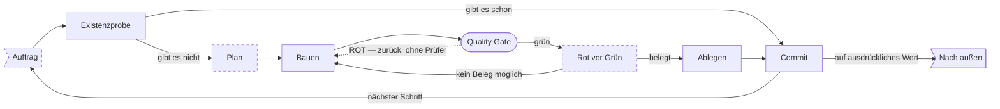

# Der eigene Ablauf — und wo er nur Absicht ist

**Erzeugt von `melder/landkarten.py` — nicht von Hand ändern.**

Gestrichelt = **kein Mechanismus setzt diesen Schritt durch**. 3 von 9 Schritten sind heute blosse Absicht: Auftrag, Plan, Rot vor Grün.
