# Agenten und ihre Auslöser — was wirklich verdrahtet ist

**Erzeugt von `melder/landkarten.py` — nicht von Hand ändern.**

```mermaid
graph LR
  subgraph lauf["Der Lauf eines Agenten"]
    modell(["Modell entscheidet"])
    werkzeug["Werkzeug laeuft"]
    halt(["Haltepunkt"])
    modell -->|waehlt| werkzeug
    werkzeug -->|Ergebnis| modell
    modell -->|fertig?| halt
    halt -->|decision: block| modell
  end
  ev_PostToolUse(["PostToolUse"])
  werkzeug -.->|loest aus| ev_PostToolUse
  s_chronist_py["chronist.py"]
  ev_PostToolUse -->|global| s_chronist_py
  s_monolith_guard_py["monolith_guard.py"]
  ev_PostToolUse -->|global| s_monolith_guard_py
  s_entwurfsprobe_hook_py["entwurfsprobe_hook.py"]
  class s_entwurfsprobe_hook_py entscheidet
  ev_PostToolUse -->|global| s_entwurfsprobe_hook_py
  s_agent_register_hook_py["agent_register_hook.py"]
  ev_PostToolUse -->|global| s_agent_register_hook_py
  s_arbeitsmelder_py["arbeitsmelder.py"]
  ev_PostToolUse -->|global| s_arbeitsmelder_py
  s_ui_guard_hook_py["ui_guard_hook.py"]
  ev_PostToolUse -->|global| s_ui_guard_hook_py
  s_stand_format_waechter_hook_py["stand_format_waechter_hook.py"]
  ev_PostToolUse -->|global| s_stand_format_waechter_hook_py
  s_uebergabe_pfade_py["uebergabe_pfade.py"]
  ev_PostToolUse -->|global| s_uebergabe_pfade_py
  s_eilmeldung_hook_py["eilmeldung_hook.py"]
  ev_PostToolUse -->|global| s_eilmeldung_hook_py
  s_sichtbarkeit_py["sichtbarkeit.py"]
  ev_PostToolUse -->|global| s_sichtbarkeit_py
  s_eilmeldung_frisch_py["eilmeldung_frisch.py"]
  ev_PostToolUse -->|global| s_eilmeldung_frisch_py
  ev_PreToolUse(["PreToolUse"])
  werkzeug -.->|loest aus| ev_PreToolUse
  s_agent_model_guard_py["agent_model_guard.py"]
  class s_agent_model_guard_py entscheidet
  ev_PreToolUse -->|global| s_agent_model_guard_py
  s_agent_reuse_guard_hook_py["agent_reuse_guard_hook.py"]
  class s_agent_reuse_guard_hook_py entscheidet
  ev_PreToolUse -->|global| s_agent_reuse_guard_hook_py
  s_cascade_guard_hook_py["cascade_guard_hook.py"]
  class s_cascade_guard_hook_py entscheidet
  ev_PreToolUse -->|global| s_cascade_guard_hook_py
  s_commit_guard_hook_py["commit_guard_hook.py"]
  class s_commit_guard_hook_py entscheidet
  ev_PreToolUse -->|global| s_commit_guard_hook_py
  s_stash_guard_hook_py["stash_guard_hook.py"]
  class s_stash_guard_hook_py entscheidet
  ev_PreToolUse -->|global| s_stash_guard_hook_py
  s_auftragshypothese_waechter_py["auftragshypothese_waechter.py"]
  class s_auftragshypothese_waechter_py entscheidet
  ev_PreToolUse -->|global| s_auftragshypothese_waechter_py
  s_regelrouting_py["regelrouting.py"]
  ev_PreToolUse -->|global| s_regelrouting_py
  ev_SessionStart(["SessionStart"])
  modell -.->|loest aus| ev_SessionStart
  s_bsi_session_hint_py["bsi_session_hint.py"]
  ev_SessionStart -->|global| s_bsi_session_hint_py
  s_ausloeserlos_py["ausloeserlos.py"]
  ev_SessionStart -->|global| s_ausloeserlos_py
  s_eilmeldung_etikett_py["eilmeldung_etikett.py"]
  ev_SessionStart -->|global| s_eilmeldung_etikett_py
  s_kantenstillstand_py["kantenstillstand.py"]
  ev_SessionStart -->|global| s_kantenstillstand_py
  s_vektorstand_py["vektorstand.py"]
  ev_SessionStart -->|global| s_vektorstand_py
  s_faelligkeit_py["faelligkeit.py"]
  ev_SessionStart -->|global| s_faelligkeit_py
  s_build_node_index_py["build_node_index.py"]
  ev_SessionStart -->|global| s_build_node_index_py
  s_metroviz_autostart_sh["metroviz_autostart.sh"]
  ev_SessionStart -->|global| s_metroviz_autostart_sh
  s_wissensverlauf_py["wissensverlauf.py"]
  ev_SessionStart -->|global| s_wissensverlauf_py
  ev_SessionStart -->|global| s_sichtbarkeit_py
  s_wiedereinstieg_py["wiedereinstieg.py"]
  ev_SessionStart -->|global| s_wiedereinstieg_py
  s_modell_abfrage_hook_py["modell_abfrage_hook.py"]
  ev_SessionStart -->|global| s_modell_abfrage_hook_py
  s_settings_guard_py["settings_guard.py"]
  ev_SessionStart -->|global| s_settings_guard_py
  s_gegenprobe_faellig_py["gegenprobe_faellig.py"]
  ev_SessionStart -->|global| s_gegenprobe_faellig_py
  s_normachsen_py["normachsen.py"]
  ev_SessionStart -->|global| s_normachsen_py
  s_pruefer_py["pruefer.py"]
  ev_SessionStart -->|global| s_pruefer_py
  s_rasterblick_py["rasterblick.py"]
  ev_SessionStart -->|global| s_rasterblick_py
  s_planbindung_py["planbindung.py"]
  ev_SessionStart -->|global| s_planbindung_py
  s_offene_arbeit_py["offene_arbeit.py"]
  ev_SessionStart -->|global| s_offene_arbeit_py
  s_eilmeldung_faellig_py["eilmeldung_faellig.py"]
  ev_SessionStart -->|global| s_eilmeldung_faellig_py
  s_derivatfrische_py["derivatfrische.py"]
  ev_SessionStart -->|global| s_derivatfrische_py
  s_worktree_identitaet_py["worktree_identitaet.py"]
  ev_SessionStart -->|global| s_worktree_identitaet_py
  s_dienstwache_py["dienstwache.py"]
  ev_SessionStart -->|global| s_dienstwache_py
  s_bewegungsmelder_py["bewegungsmelder.py"]
  ev_SessionStart -->|global| s_bewegungsmelder_py
  s_fremdstandsvergleich_py["fremdstandsvergleich.py"]
  ev_SessionStart -->|global| s_fremdstandsvergleich_py
  ev_Stop(["Stop"])
  halt -.->|loest aus| ev_Stop
  s_codemap_active_py["codemap_active.py"]
  ev_Stop -->|global| s_codemap_active_py
  s_quality_gate_hook_py["quality_gate_hook.py"]
  class s_quality_gate_hook_py entscheidet
  ev_Stop -->|global| s_quality_gate_hook_py
  s_knowledge_capture_hook_py["knowledge_capture_hook.py"]
  class s_knowledge_capture_hook_py entscheidet
  ev_Stop -->|global| s_knowledge_capture_hook_py
  ev_Stop -->|global| s_wissensverlauf_py
  s_auszug_nachziehen_py["auszug_nachziehen.py"]
  ev_Stop -->|global| s_auszug_nachziehen_py
  s_antwort_abruf_py["antwort_abruf.py"]
  ev_Stop -->|global| s_antwort_abruf_py
  s_dateilink_waechter_py["dateilink_waechter.py"]
  class s_dateilink_waechter_py entscheidet
  ev_Stop -->|global| s_dateilink_waechter_py
  s_rueckfrageschleife_py["rueckfrageschleife.py"]
  class s_rueckfrageschleife_py entscheidet
  ev_Stop -->|global| s_rueckfrageschleife_py
  s_vermutungswaechter_py["vermutungswaechter.py"]
  class s_vermutungswaechter_py entscheidet
  ev_Stop -->|global| s_vermutungswaechter_py
  s_korrekturlehre_py["korrekturlehre.py"]
  class s_korrekturlehre_py entscheidet
  ev_Stop -->|global| s_korrekturlehre_py
  s_kaskadenanteil_py["kaskadenanteil.py"]
  ev_Stop -->|global| s_kaskadenanteil_py
  s_abgabepruefung_py["abgabepruefung.py"]
  ev_Stop -->|global| s_abgabepruefung_py
  ev_SubagentStart(["SubagentStart"])
  modell -.->|loest aus| ev_SubagentStart
  ev_SubagentStart -->|global| s_agent_register_hook_py
  s_auftrag_recall_hook_py["auftrag_recall_hook.py"]
  ev_SubagentStart -->|global| s_auftrag_recall_hook_py
  s_mcp_veraltet_py["mcp_veraltet.py"]
  ev_SubagentStart -->|global| s_mcp_veraltet_py
  s_regelwechsel_py["regelwechsel.py"]
  ev_SubagentStart -->|global| s_regelwechsel_py
  ev_SubagentStop(["SubagentStop"])
  halt -.->|loest aus| ev_SubagentStop
  ev_SubagentStop -->|global| s_agent_register_hook_py
  ev_UserPromptSubmit(["UserPromptSubmit"])
  modell -.->|loest aus| ev_UserPromptSubmit
  s_knowledge_recall_hook_py["knowledge_recall_hook.py"]
  ev_UserPromptSubmit -->|global| s_knowledge_recall_hook_py
  s_stand_recall_hook_py["stand_recall_hook.py"]
  ev_UserPromptSubmit -->|global| s_stand_recall_hook_py
  ev_UserPromptSubmit -->|global| s_auftrag_recall_hook_py
  ev_UserPromptSubmit -->|global| s_mcp_veraltet_py
  ev_UserPromptSubmit -->|global| s_antwort_abruf_py
  ev_UserPromptSubmit -->|global| s_regelwechsel_py
  ev_UserPromptSubmit -->|global| s_eilmeldung_frisch_py
  ev_WorktreeCreate(["WorktreeCreate"])
  werkzeug -.->|loest aus| ev_WorktreeCreate
  ev_WorktreeCreate -->|global| s_worktree_identitaet_py
  s_kontextstand_py["kontextstand.py"]
  ev_PostToolUse -->|repo| s_kontextstand_py
  ev_PreToolUse -->|repo| s_stash_guard_hook_py
  s_agentenanker_abruf_py["agentenanker_abruf.py"]
  class s_agentenanker_abruf_py entscheidet
  ev_PreToolUse -->|repo| s_agentenanker_abruf_py
  ev_SessionStart -->|repo| s_eilmeldung_etikett_py
  ev_SessionStart -->|repo| s_kantenstillstand_py
  s_kurator_taeglich_py["kurator_taeglich.py"]
  ev_SessionStart -->|repo| s_kurator_taeglich_py
  s_existenzpruefung_py["existenzpruefung.py"]
  ev_Stop -->|repo| s_existenzpruefung_py
  s_agentenanker_einspielung_py["agentenanker_einspielung.py"]
  ev_SubagentStart -->|repo| s_agentenanker_einspielung_py
  ag_cavecrew_builder>"Agent cavecrew-builder"]
  ag_cavecrew_investigator>"Agent cavecrew-investigator"]
  ag_cavecrew_reviewer>"Agent cavecrew-reviewer"]
  ag_compliance>"Agent compliance"]
  classDef waise stroke-dasharray: 5 5
  classDef entscheidet stroke-width:4px
```

76 Verdrahtungen aus zwei Einstellungsdateien (global und repo-eigen — wer nur eine liest, misst falsch), 4 Agententypen. Ein Ereignis, an dem nichts hängt, kann nichts auslösen.
