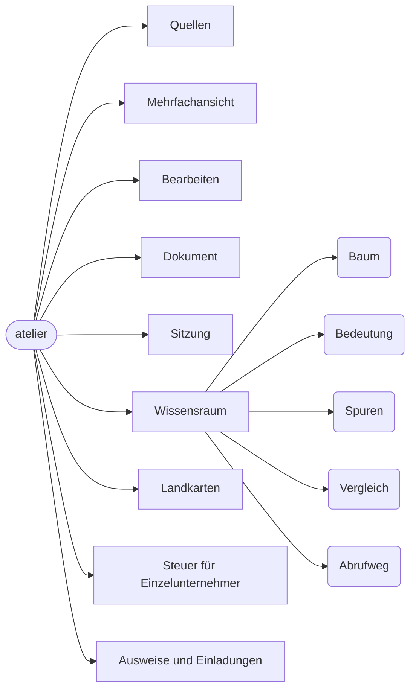

# Aufbau der Anwendung — Bildschirme und Bedienwege

**Erzeugt von `melder/landkarten.py` — nicht von Hand ändern.**

```mermaid
graph LR
  app(["atelier"])
  Quellen["Quellen"]
  app --> Quellen
  Mehrfachansicht["Mehrfachansicht"]
  app --> Mehrfachansicht
  Bearbeiten["Bearbeiten"]
  app --> Bearbeiten
  Dokument["Dokument"]
  app --> Dokument
  Sitzung["Sitzung"]
  app --> Sitzung
  Wissensraum["Wissensraum"]
  app --> Wissensraum
  Landkarten["Landkarten"]
  app --> Landkarten
  Steuer_für_Einzelunternehmer["Steuer für Einzelunternehmer"]
  app --> Steuer_für_Einzelunternehmer
  Ausweise_und_Einladungen["Ausweise und Einladungen"]
  app --> Ausweise_und_Einladungen
  blick_Baum("Baum")
  Wissensraum --> blick_Baum
  blick_Bedeutung("Bedeutung")
  Wissensraum --> blick_Bedeutung
  blick_Spuren("Spuren")
  Wissensraum --> blick_Spuren
  blick_Vergleich("Vergleich")
  Wissensraum --> blick_Vergleich
  blick_Abrufweg("Abrufweg")
  Wissensraum --> blick_Abrufweg
```