# Der Wissensbestand — Äste und ihre Verbindungen

**Erzeugt von `melder/landkarten.py` — nicht von Hand ändern.**

```mermaid
graph LR
  germanquad["germanquad<br/>2713"]
  bsi_sdt["bsi-sdt<br/>1903"]
  nasa_llis["nasa-llis<br/>1638"]
  brainlehr["brainlehr<br/>410"]
  methodik["methodik<br/>175"]
  apps["apps<br/>112"]
  ops["ops<br/>95"]
  projects["projects<br/>64"]
  shared["shared<br/>59"]
  openlehr["openlehr<br/>47"]
  plaene["plaene<br/>17"]
  arch["arch<br/>16"]
  simulation_akademie_messaufbau_kein["simulation-akademie-messaufbau-kein<br/>15"]
  wcag_2_2["wcag-2-2<br/>11"]
  fahrtenbuch["fahrtenbuch<br/>9"]
  werkzeuge["werkzeuge<br/>8"]
  tools["tools<br/>8"]
  testing["testing<br/>8"]
  frontend["frontend<br/>7"]
  agents["agents<br/>7"]
  domaenen["domaenen<br/>5"]
  backend["backend<br/>4"]
  lessons["lessons<br/>3"]
  dokumente["dokumente<br/>3"]
  stadtwerke["stadtwerke<br/>2"]
  begod["begod<br/>2"]
  workflow_impact_evidence_rejects["workflow-impact-evidence-rejects<br/>1"]
  woanders["woanders<br/>1"]
  testdatenknoten_schreibrechtepruefung["testdatenknoten-schreibrechtepruefung<br/>1"]
  p96_feasibility_and_p86_intent_outcome["p96-feasibility-and-p86-intent-outcome<br/>1"]
  p83_p85_provenance_and_incident["p83-p85-provenance-and-incident<br/>1"]
  journey_and_slo_evidence_remain["journey-and-slo-evidence-remain<br/>1"]
  independent_runtime_witnesses_fail["independent-runtime-witnesses-fail<br/>1"]
  fail_closed_artifact_and_analyzer["fail-closed-artifact-and-analyzer<br/>1"]
  domaenenimporte["domaenenimporte<br/>1"]
  conservative_architecture_health["conservative-architecture-health<br/>1"]
  capability_and_lifecycle_contracts_are["capability-and-lifecycle-contracts-are<br/>1"]
  bebetter["bebetter<br/>1"]
  aka["aka<br/>1"]
  brainlehr ---|126| methodik
  brainlehr ---|36| openlehr
  apps ---|26| brainlehr
  apps ---|25| shared
  apps ---|24| methodik
  brainlehr ---|23| plaene
```

Zahl im Kasten = Knoten im Ast, Zahl an der Kante = Verbindungen zwischen zwei Ästen (ab 20, hoechstens 40 staerkste; 6 gezeigt).
