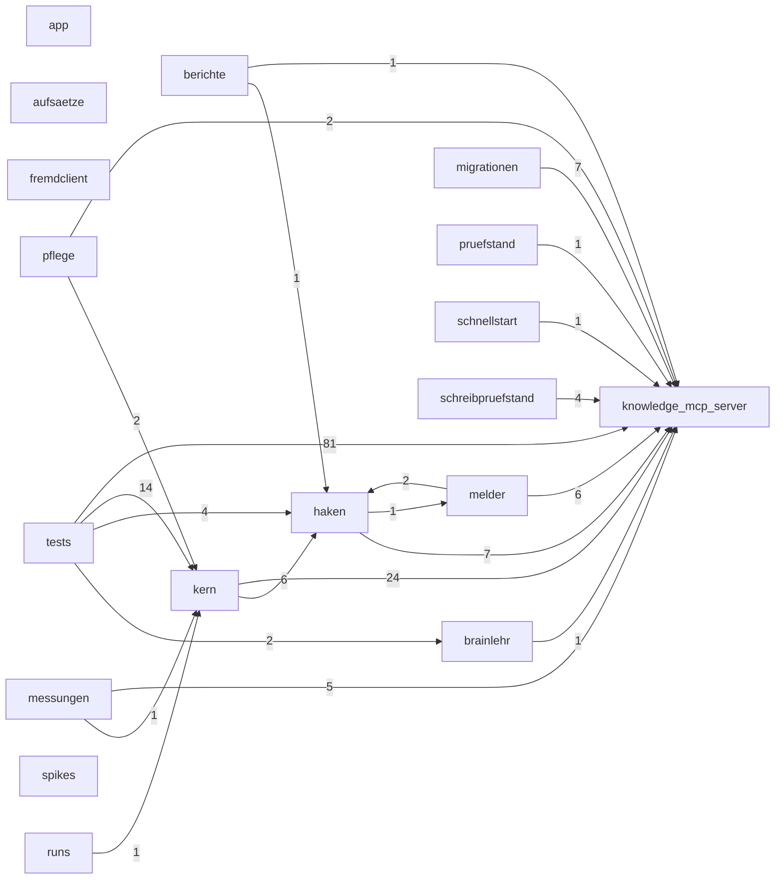

# Code-Struktur: brainlehr

**Erzeugt von `melder/landkarten.py` — nicht von Hand ändern.**

Ein Kasten ist ein Verzeichnis, die Zahl an der Kante sagt, wie viele Dateien diesen Weg gehen. 18 Module, 22 Verbindungen.
