# Code-Struktur: hub

**Erzeugt von `melder/landkarten.py` — nicht von Hand ändern.**

```mermaid
graph LR
  __init__["__init__"]
  _find_missing2["_find_missing2"]
  _import_manual_sources["_import_manual_sources"]
  _obd_merge_tmp["_obd_merge_tmp"]
  _read_dr["_read_dr"]
  _verify_obd_positions["_verify_obd_positions"]
  agent_live_log["agent_live_log"]
  agent_model_guard["agent_model_guard"]
  agent_register_hook["agent_register_hook"]
  agent_register_ort["agent_register_ort"]
  agent_reuse_guard_hook["agent_reuse_guard_hook"]
  agent_router["agent_router"]
  agent_validator["agent_validator"]
  ai_export["ai_export"]
  ai_image_forge["ai_image_forge"]
  ai_image_forge_native_ui["ai_image_forge_native_ui"]
  ai_image_forge_ui_server["ai_image_forge_ui_server"]
  analyze_agent_gaps["analyze_agent_gaps"]
  analyze_comments["analyze_comments"]
  analyze_crm["analyze_crm"]
  analyze_demo_log["analyze_demo_log"]
  analyze_large_files["analyze_large_files"]
  analyze_tracks["analyze_tracks"]
  architecture["architecture"]
  audit_p28_konsil["audit_p28_konsil"]
  audit_paper_fulltext["audit_paper_fulltext"]
  audit_profiles["audit_profiles"]
  audit_rating_index["audit_rating_index"]
  auto_commit["auto_commit"]
  begod_doctor["begod_doctor"]
  begod_livetest["begod_livetest"]
  begod_test["begod_test"]
  begod_time["begod_time"]
  behauptete_pruefung["behauptete_pruefung"]
  benchmark_download["benchmark_download"]
  benchmark_drbench["benchmark_drbench"]
  benchmark_gaia2["benchmark_gaia2"]
  benchmark_xbench["benchmark_xbench"]
  beta_personas["beta_personas"]
  ble_server["ble_server"]
  ble_server_bless["ble_server_bless"]
  bsi_catalog_parser["bsi_catalog_parser"]
  bsi_code_review["bsi_code_review"]
  bsi_cross_repo_sync["bsi_cross_repo_sync"]
  bsi_session_hint["bsi_session_hint"]
  bsi_sync_checker["bsi_sync_checker"]
  calc_personas["calc_personas"]
  cascade_guard_hook["cascade_guard_hook"]
  caveman_bulk["caveman_bulk"]
  caveman_compress["caveman_compress"]
  checkpoint_state["checkpoint_state"]
  chronist["chronist"]
  chronist_bridge["chronist_bridge"]
  citation_graph["citation_graph"]
  citation_network["citation_network"]
  click_screenshotter["click_screenshotter"]
  code_quality_report["code_quality_report"]
  code_watcher["code_watcher"]
  codemap["codemap"]
  codemap_active["codemap_active"]
  codex_guard["codex_guard"]
  commit_guard_hook["commit_guard_hook"]
  compare_recovery["compare_recovery"]
  cost_tracker["cost_tracker"]
  coverage_gap["coverage_gap"]
  crm_consilium["crm_consilium"]
  crm_consilium_phase2["crm_consilium_phase2"]
  crm_consilium_phase3["crm_consilium_phase3"]
  cross_app_compliance["cross_app_compliance"]
  cspell_sync["cspell_sync"]
  dateilink_waechter["dateilink_waechter"]
  deep_analyze_crm["deep_analyze_crm"]
  deep_research["deep_research"]
  deploy_to_worktrees["deploy_to_worktrees"]
  design_eval["design_eval"]
  diagnose_mic_onsets["diagnose_mic_onsets"]
  doc_qa["doc_qa"]
  domaenen_startauftrag["domaenen_startauftrag"]
  eilmeldung_hook["eilmeldung_hook"]
  eilmeldung_quittieren["eilmeldung_quittieren"]
  elevate_design["elevate_design"]
  elm327_handler["elm327_handler"]
  entropy_profiler["entropy_profiler"]
  entwurfsprobe_hook["entwurfsprobe_hook"]
  error_injector["error_injector"]
  export_afrika_knowledge["export_afrika_knowledge"]
  export_notebooklm["export_notebooklm"]
  extract_aka_pdfs["extract_aka_pdfs"]
  extract_cached_fulltexts["extract_cached_fulltexts"]
  extract_crossrefs["extract_crossrefs"]
  extract_local_pdfs["extract_local_pdfs"]
  extract_screen_text["extract_screen_text"]
  extract_semantics["extract_semantics"]
  fetch_papers["fetch_papers"]
  fetch_sgbv["fetch_sgbv"]
  fix_agent_categories["fix_agent_categories"]
  fix_css["fix_css"]
  flowmap_stale_check["flowmap_stale_check"]
  flutter_lldb_helper["flutter_lldb_helper"]
  focus_guardian["focus_guardian"]
  forensics["forensics"]
  gegenprobe_faellig["gegenprobe_faellig"]
  generate_code_md["generate_code_md"]
  generate_design_tokens["generate_design_tokens"]
  generate_icons["generate_icons"]
  generate_jpeg_corpus["generate_jpeg_corpus"]
  generate_realistic_wav["generate_realistic_wav"]
  generate_stamo_fleet["generate_stamo_fleet"]
  guard_audit["guard_audit"]
  hash_compare_tool["hash_compare_tool"]
  hausregeln_check["hausregeln_check"]
  heartbeat_manager["heartbeat_manager"]
  help_server["help_server"]
  idml_bridge["idml_bridge"]
  implementation["implementation"]
  init_worktree["init_worktree"]
  install_pre_push_smoke_hook["install_pre_push_smoke_hook"]
  install_push_guard["install_push_guard"]
  json_minify["json_minify"]
  knowledge_index["knowledge_index"]
  knowledge_scout["knowledge_scout"]
  knowledge_usage_report["knowledge_usage_report"]
  knowledge_watcher["knowledge_watcher"]
  konsil["konsil"]
  kontinent_filter["kontinent_filter"]
  license_audit["license_audit"]
  lineage_tracker["lineage_tracker"]
  m2_ble_dongle["m2_ble_dongle"]
  manual_harvester["manual_harvester"]
  methodik_export["methodik_export"]
  mir_pdf_fetch["mir_pdf_fetch"]
  model_advisor["model_advisor"]
  model_auto_router["model_auto_router"]
  modell_abfrage_hook["modell_abfrage_hook"]
  monolith_guard["monolith_guard"]
  multi_agent_walkthrough["multi_agent_walkthrough"]
  multi_agent_walkthrough_v2["multi_agent_walkthrough_v2"]
  mutation_review["mutation_review"]
  mycel["mycel"]
  nav_human["nav_human"]
  nav_lookup["nav_lookup"]
  nie_geschriebene_werte["nie_geschriebene_werte"]
  ollama_healthcheck["ollama_healthcheck"]
  optuna_cascade["optuna_cascade"]
  optuna_crm_grouping["optuna_crm_grouping"]
  optuna_dbscan["optuna_dbscan"]
  optuna_fuzzy_signatures["optuna_fuzzy_signatures"]
  optuna_harness["optuna_harness"]
  orchestrate["orchestrate"]
  paper_network["paper_network"]
  param_sweep["param_sweep"]
  parse_bri_to_json["parse_bri_to_json"]
  patch_autorunner["patch_autorunner"]
  pdf_design_audit["pdf_design_audit"]
  pdf_to_knowledge["pdf_to_knowledge"]
  phoenix_compare["phoenix_compare"]
  phoenix_crm_recovery["phoenix_crm_recovery"]
  phoenix_crm_v2["phoenix_crm_v2"]
  phoenix_deep_check["phoenix_deep_check"]
  phoenix_deep_scan["phoenix_deep_scan"]
  phoenix_diag["phoenix_diag"]
  phoenix_forensic["phoenix_forensic"]
  phoenix_probe["phoenix_probe"]
  phoenix_probe2["phoenix_probe2"]
  phoenix_probe3["phoenix_probe3"]
  phoenix_validate["phoenix_validate"]
  phoenix_verify["phoenix_verify"]
  play_test_patterns["play_test_patterns"]
  postfach_manager["postfach_manager"]
  postfach_router["postfach_router"]
  print_watcher["print_watcher"]
  profile_generator["profile_generator"]
  projekt_waehler_hook["projekt_waehler_hook"]
  prompt_budget_guard["prompt_budget_guard"]
  prompt_bundle_builder["prompt_bundle_builder"]
  push_guard["push_guard"]
  quality_baseline["quality_baseline"]
  quality_gate_hook["quality_gate_hook"]
  quellen_faelligkeit["quellen_faelligkeit"]
  quellenbeleg["quellenbeleg"]
  quick_fix["quick_fix"]
  quick_scan_canon["quick_scan_canon"]
  ram_stem_calibration["ram_stem_calibration"]
  rank_evals["rank_evals"]
  refactor_renderer["refactor_renderer"]
  remove_redundant_comments["remove_redundant_comments"]
  retrofit_hint["retrofit_hint"]
  revert_design["revert_design"]
  review_gate["review_gate"]
  run_p2c_pipeline["run_p2c_pipeline"]
  safe_long_job["safe_long_job"]
  scan_canon["scan_canon"]
  scan_codebase["scan_codebase"]
  scrape_100jahre_website["scrape_100jahre_website"]
  scrape_aka_100jahre["scrape_aka_100jahre"]
  scrape_aka_website["scrape_aka_website"]
  security_audit["security_audit"]
  serve_metroviz["serve_metroviz"]
  server["server"]
  session_compact["session_compact"]
  session_dashboard["session_dashboard"]
  session_edit_tick["session_edit_tick"]
  session_preflight["session_preflight"]
  session_start["session_start"]
  settings_guard["settings_guard"]
  settings_sync["settings_sync"]
  setup_companion_buttons["setup_companion_buttons"]
  simulator["simulator"]
  simulator_gui["simulator_gui"]
  smoke_begod_rollout["smoke_begod_rollout"]
  sprint_runner["sprint_runner"]
  stand_index_hook["stand_index_hook"]
  stand_recall_hook["stand_recall_hook"]
  stem_server["stem_server"]
  strip_comments["strip_comments"]
  strip_python["strip_python"]
  sweep_1000["sweep_1000"]
  sweep_2group["sweep_2group"]
  sweep_subbands["sweep_subbands"]
  symbolindex["symbolindex"]
  sync_begod_policy["sync_begod_policy"]
  sync_citations_to_xrefs["sync_citations_to_xrefs"]
  sync_dag_status["sync_dag_status"]
  system_health["system_health"]
  system_specs["system_specs"]
  systemabgleich_hinweis["systemabgleich_hinweis"]
  telegram_bridge["telegram_bridge"]
  test_agent_register_hook["test_agent_register_hook"]
  test_agent_reuse_guard_hook["test_agent_reuse_guard_hook"]
  test_agent_system["test_agent_system"]
  test_ai_image_forge_queue_reset["test_ai_image_forge_queue_reset"]
  test_codemap_flow_skeleton["test_codemap_flow_skeleton"]
  test_codex_guards["test_codex_guards"]
  test_commit_guard["test_commit_guard"]
  test_e2e_ble["test_e2e_ble"]
  test_eilmeldung_hook["test_eilmeldung_hook"]
  test_flowmap_stale_check["test_flowmap_stale_check"]
  test_methodik_export["test_methodik_export"]
  test_model_routing["test_model_routing"]
  test_profiles["test_profiles"]
  test_push_guard["test_push_guard"]
  test_quality_gate_hook["test_quality_gate_hook"]
  test_server["test_server"]
  test_walkthrough_agents["test_walkthrough_agents"]
  test_walkthrough_v2["test_walkthrough_v2"]
  test_wiedereinstieg["test_wiedereinstieg"]
  tote_bausteine["tote_bausteine"]
  trust_factor["trust_factor"]
  uebergabe_pfade["uebergabe_pfade"]
  ui_dump["ui_dump"]
  unverdrahtet["unverdrahtet"]
  update_vis["update_vis"]
  validate_agent_system["validate_agent_system"]
  validate_konsil_json["validate_konsil_json"]
  validate_nba_algorithm["validate_nba_algorithm"]
  vehicle_profiles["vehicle_profiles"]
  verify_ema_fix["verify_ema_fix"]
  version_bump["version_bump"]
  walkthrough_agents["walkthrough_agents"]
  walkthrough_analyzer["walkthrough_analyzer"]
  watch_agent["watch_agent"]
  wiedereinstieg["wiedereinstieg"]
  wiring_check["wiring_check"]
  agent_live_log -->|1| begod_time
  agent_register_hook -->|1| agent_register_ort
  agent_reuse_guard_hook -->|1| agent_register_ort
  ai_export -->|1| begod_time
  ai_image_forge_ui_server -->|1| ai_image_forge
  beta_personas -->|1| test_profiles
  bsi_sync_checker -->|1| bsi_catalog_parser
  calc_personas -->|1| beta_personas
  caveman_bulk -->|1| caveman_compress
  chronist -->|1| begod_time
  chronist_bridge -->|1| begod_time
  commit_guard_hook -->|1| agent_register_ort
  cross_app_compliance -->|1| begod_time
  diagnose_mic_onsets -->|1| ram_stem_calibration
  diagnose_mic_onsets -->|1| stem_server
  doc_qa -->|1| begod_time
  elm327_handler -->|1| vehicle_profiles
  focus_guardian -->|1| begod_time
  focus_guardian -->|1| kontinent_filter
  guard_audit -->|1| agent_register_ort
  json_minify -->|1| caveman_compress
  knowledge_scout -->|1| begod_time
  m2_ble_dongle -->|1| ble_server_bless
  m2_ble_dongle -->|1| elm327_handler
  m2_ble_dongle -->|1| error_injector
  m2_ble_dongle -->|1| simulator
  m2_ble_dongle -->|1| vehicle_profiles
  multi_agent_walkthrough -->|1| walkthrough_agents
  multi_agent_walkthrough_v2 -->|1| walkthrough_agents
  param_sweep -->|1| ram_stem_calibration
  param_sweep -->|1| stem_server
  phoenix_crm_v2 -->|2| phoenix_crm_recovery
  phoenix_validate -->|1| phoenix_crm_recovery
  play_test_patterns -->|1| ram_stem_calibration
  projekt_waehler_hook -->|1| agent_register_ort
  push_guard -->|1| agent_register_ort
  push_guard -->|1| agent_reuse_guard_hook
  quality_gate_hook -->|1| agent_register_ort
  ram_stem_calibration -->|2| stem_server
  scan_codebase -->|1| begod_time
  session_dashboard -->|1| begod_time
  session_dashboard -->|1| kontinent_filter
  session_preflight -->|1| begod_time
  session_preflight -->|1| model_auto_router
  session_start -->|1| begod_time
  simulator -->|1| ble_server
  simulator -->|1| ble_server_bless
  simulator -->|1| elm327_handler
  simulator -->|1| error_injector
  simulator -->|1| vehicle_profiles
  simulator_gui -->|1| ble_server_bless
  simulator_gui -->|1| elm327_handler
  simulator_gui -->|1| error_injector
  simulator_gui -->|1| vehicle_profiles
  sweep_1000 -->|1| ram_stem_calibration
  sweep_1000 -->|1| stem_server
  sweep_2group -->|1| ram_stem_calibration
  sweep_2group -->|1| stem_server
  sweep_subbands -->|1| ram_stem_calibration
  sweep_subbands -->|1| stem_server
  sweep_subbands -->|1| sweep_2group
  test_agent_register_hook -->|1| agent_register_hook
  test_agent_reuse_guard_hook -->|1| agent_reuse_guard_hook
  test_codemap_flow_skeleton -->|1| codemap
  test_e2e_ble -->|1| elm327_handler
  test_e2e_ble -->|1| error_injector
  test_e2e_ble -->|1| vehicle_profiles
  test_flowmap_stale_check -->|1| flowmap_stale_check
  test_profiles -->|1| beta_personas
  test_push_guard -->|1| push_guard
  test_wiedereinstieg -->|1| wiedereinstieg
  unverdrahtet -->|1| tote_bausteine
  verify_ema_fix -->|1| stem_server
```

Ein Kasten ist eine Datei, die Zahl an der Kante sagt, wie viele Dateien diesen Weg gehen. 263 Module, 73 Verbindungen.
