# Der Verbund — wer redet mit wem

**Erzeugt von `melder/landkarten.py` — nicht von Hand ändern.**

```mermaid
graph LR
  port_1234(["Port 1234 (fremd)"])
  _brainlehr_public -->|ruft| port_1234
  _probe_head -->|ruft| port_1234
  atelier -->|ruft| port_1234
  brainlehr -->|ruft| port_1234
  hub -->|ruft| port_1234
  openlehr_einzelunternehmer -->|ruft| port_1234
  openlehr_legacy -->|ruft| port_1234
  stiftshuette -->|ruft| port_1234
  port_2026(["Port 2026"])
  atelier -->|lauscht| port_2026
  fahrtenbuch -->|lauscht| port_2026
  class port_2026 waise
  port_4141(["Port 4141 (fremd)"])
  openlehr_einzelunternehmer -->|ruft| port_4141
  openlehr_legacy -->|ruft| port_4141
  openlehr_stale_2026_07_22 -->|ruft| port_4141
  snake -->|ruft| port_4141
  port_4242(["Port 4242"])
  legacylink -->|lauscht| port_4242
  openlehr_einzelunternehmer -->|lauscht| port_4242
  openlehr_legacy -->|lauscht| port_4242
  openlehr_stale_2026_07_22 -->|lauscht| port_4242
  snake -->|lauscht| port_4242
  port_4243(["Port 4243 (fremd)"])
  openlehr_einzelunternehmer -->|ruft| port_4243
  openlehr_legacy -->|ruft| port_4243
  openlehr_stale_2026_07_22 -->|ruft| port_4243
  snake -->|ruft| port_4243
  port_4343(["Port 4343 (fremd)"])
  openlehr_einzelunternehmer -->|ruft| port_4343
  openlehr_legacy -->|ruft| port_4343
  port_4433(["Port 4433"])
  videoki -->|lauscht| port_4433
  class port_4433 waise
  port_4599(["Port 4599 (fremd)"])
  atelier -->|ruft| port_4599
  brainlehr -->|ruft| port_4599
  port_4610(["Port 4610 (fremd)"])
  atelier -->|ruft| port_4610
  brainlehr -->|ruft| port_4610
  port_4611(["Port 4611"])
  _brainlehr_public -->|lauscht| port_4611
  atelier -->|lauscht| port_4611
  brainlehr -->|lauscht| port_4611
  port_5005(["Port 5005 (fremd)"])
  openlehr_einzelunternehmer -->|ruft| port_5005
  openlehr_legacy -->|ruft| port_5005
  openlehr_stale_2026_07_22 -->|ruft| port_5005
  snake -->|ruft| port_5005
  port_5601(["Port 5601 (fremd)"])
  UsbKabelTester -->|ruft| port_5601
  afrika -->|ruft| port_5601
  buckeberg -->|ruft| port_5601
  design_lab -->|ruft| port_5601
  drg -->|ruft| port_5601
  drobo_nas -->|ruft| port_5601
  fahrtenbuch -->|ruft| port_5601
  hub -->|ruft| port_5601
  legacylink -->|ruft| port_5601
  markusx25 -->|ruft| port_5601
  openhood -->|ruft| port_5601
  openlehr_legacy -->|ruft| port_5601
  openlehr_stale_2026_07_22 -->|ruft| port_5601
  pflegelotse -->|ruft| port_5601
  phoenix -->|ruft| port_5601
  schwarmwacht -->|ruft| port_5601
  snake -->|ruft| port_5601
  steueroase_asien -->|ruft| port_5601
  stiftshuette -->|ruft| port_5601
  wpdrop -->|ruft| port_5601
  port_5678(["Port 5678"])
  videoki -->|lauscht| port_5678
  class port_5678 waise
  port_7331(["Port 7331"])
  buckeberg -->|lauscht| port_7331
  design_lab -->|lauscht| port_7331
  drobo_nas -->|lauscht| port_7331
  fahrtenbuch -->|lauscht| port_7331
  hub -->|lauscht| port_7331
  openlehr_legacy -->|lauscht| port_7331
  openlehr_stale_2026_07_22 -->|lauscht| port_7331
  schwarmwacht -->|lauscht| port_7331
  snake -->|lauscht| port_7331
  steueroase_asien -->|lauscht| port_7331
  stiftshuette -->|lauscht| port_7331
  wpdrop -->|lauscht| port_7331
  port_7340(["Port 7340"])
  afrika -->|lauscht| port_7340
  class port_7340 waise
  port_7788(["Port 7788 (fremd)"])
  buckeberg -->|ruft| port_7788
  hub -->|ruft| port_7788
  openlehr_einzelunternehmer -->|ruft| port_7788
  openlehr_legacy -->|ruft| port_7788
  openlehr_stale_2026_07_22 -->|ruft| port_7788
  schwarmwacht -->|ruft| port_7788
  snake -->|ruft| port_7788
  steueroase_asien -->|ruft| port_7788
  stiftshuette -->|ruft| port_7788
  wpdrop -->|ruft| port_7788
  port_7860(["Port 7860"])
  videoki -->|lauscht| port_7860
  class port_7860 waise
  port_8000(["Port 8000"])
  videoki -->|lauscht| port_8000
  UsbKabelTester -->|ruft| port_8000
  afrika -->|ruft| port_8000
  buckeberg -->|ruft| port_8000
  design_lab -->|ruft| port_8000
  drg -->|ruft| port_8000
  drobo_nas -->|ruft| port_8000
  fahrtenbuch -->|ruft| port_8000
  hub -->|ruft| port_8000
  legacylink -->|ruft| port_8000
  markusx25 -->|ruft| port_8000
  openhood -->|ruft| port_8000
  openlehr_legacy -->|ruft| port_8000
  openlehr_stale_2026_07_22 -->|ruft| port_8000
  pflegelotse -->|ruft| port_8000
  phoenix -->|ruft| port_8000
  schwarmwacht -->|ruft| port_8000
  snake -->|ruft| port_8000
  steueroase_asien -->|ruft| port_8000
  stiftshuette -->|ruft| port_8000
  wpdrop -->|ruft| port_8000
  port_8025(["Port 8025 (fremd)"])
  design_lab -->|ruft| port_8025
  videoki -->|ruft| port_8025
  port_8080(["Port 8080"])
  videoki -->|lauscht| port_8080
  buckeberg -->|ruft| port_8080
  design_lab -->|ruft| port_8080
  drobo_nas -->|ruft| port_8080
  hub -->|ruft| port_8080
  markusx25 -->|ruft| port_8080
  openlehr_legacy -->|ruft| port_8080
  openlehr_stale_2026_07_22 -->|ruft| port_8080
  schwarmwacht -->|ruft| port_8080
  setfunk -->|ruft| port_8080
  snake -->|ruft| port_8080
  steueroase_asien -->|ruft| port_8080
  stiftshuette -->|ruft| port_8080
  wpdrop -->|ruft| port_8080
  port_8088(["Port 8088 (fremd)"])
  phoenix -->|ruft| port_8088
  wpdrop -->|ruft| port_8088
  port_8090(["Port 8090 (fremd)"])
  markusx25 -->|ruft| port_8090
  steueroase_asien -->|ruft| port_8090
  port_8091(["Port 8091"])
  steueroase_asien -->|lauscht| port_8091
  class port_8091 waise
  port_8095(["Port 8095 (fremd)"])
  phoenix -->|ruft| port_8095
  wpdrop -->|ruft| port_8095
  port_8744(["Port 8744 (fremd)"])
  buckeberg -->|ruft| port_8744
  hub -->|ruft| port_8744
  port_8765(["Port 8765"])
  buckeberg -->|lauscht| port_8765
  design_lab -->|lauscht| port_8765
  drobo_nas -->|lauscht| port_8765
  fahrtenbuch -->|lauscht| port_8765
  hub -->|lauscht| port_8765
  openlehr_legacy -->|lauscht| port_8765
  openlehr_stale_2026_07_22 -->|lauscht| port_8765
  schwarmwacht -->|lauscht| port_8765
  snake -->|lauscht| port_8765
  steueroase_asien -->|lauscht| port_8765
  stiftshuette -->|lauscht| port_8765
  wpdrop -->|lauscht| port_8765
  class port_8765 waise
  port_8787(["Port 8787 (fremd)"])
  UsbKabelTester -->|ruft| port_8787
  afrika -->|ruft| port_8787
  buckeberg -->|ruft| port_8787
  design_lab -->|ruft| port_8787
  drg -->|ruft| port_8787
  drobo_nas -->|ruft| port_8787
  fahrtenbuch -->|ruft| port_8787
  hub -->|ruft| port_8787
  legacylink -->|ruft| port_8787
  markusx25 -->|ruft| port_8787
  openhood -->|ruft| port_8787
  openlehr_legacy -->|ruft| port_8787
  openlehr_stale_2026_07_22 -->|ruft| port_8787
  pflegelotse -->|ruft| port_8787
  phoenix -->|ruft| port_8787
  schwarmwacht -->|ruft| port_8787
  snake -->|ruft| port_8787
  steueroase_asien -->|ruft| port_8787
  stiftshuette -->|ruft| port_8787
  wpdrop -->|ruft| port_8787
  port_8799(["Port 8799"])
  _probe_head -->|lauscht| port_8799
  atelier -->|lauscht| port_8799
  brainlehr -->|lauscht| port_8799
  _brainlehr_public -->|ruft| port_8799
  port_8933(["Port 8933 (fremd)"])
  atelier -->|ruft| port_8933
  brainlehr -->|ruft| port_8933
  port_8934(["Port 8934 (fremd)"])
  _brainlehr_public -->|ruft| port_8934
  atelier -->|ruft| port_8934
  brainlehr -->|ruft| port_8934
  port_9000(["Port 9000"])
  afrika -->|lauscht| port_9000
  class port_9000 waise
  port_9100(["Port 9100"])
  fahrtenbuch -->|lauscht| port_9100
  buckeberg -->|ruft| port_9100
  design_lab -->|ruft| port_9100
  drobo_nas -->|ruft| port_9100
  hub -->|ruft| port_9100
  openlehr_legacy -->|ruft| port_9100
  openlehr_stale_2026_07_22 -->|ruft| port_9100
  schwarmwacht -->|ruft| port_9100
  snake -->|ruft| port_9100
  steueroase_asien -->|ruft| port_9100
  stiftshuette -->|ruft| port_9100
  wpdrop -->|ruft| port_9100
  port_9200(["Port 9200 (fremd)"])
  UsbKabelTester -->|ruft| port_9200
  afrika -->|ruft| port_9200
  buckeberg -->|ruft| port_9200
  design_lab -->|ruft| port_9200
  drg -->|ruft| port_9200
  drobo_nas -->|ruft| port_9200
  fahrtenbuch -->|ruft| port_9200
  hub -->|ruft| port_9200
  legacylink -->|ruft| port_9200
  markusx25 -->|ruft| port_9200
  openhood -->|ruft| port_9200
  openlehr_legacy -->|ruft| port_9200
  openlehr_stale_2026_07_22 -->|ruft| port_9200
  pflegelotse -->|ruft| port_9200
  phoenix -->|ruft| port_9200
  schwarmwacht -->|ruft| port_9200
  snake -->|ruft| port_9200
  steueroase_asien -->|ruft| port_9200
  stiftshuette -->|ruft| port_9200
  wpdrop -->|ruft| port_9200
  port_9323(["Port 9323"])
  markusx25 -->|lauscht| port_9323
  class port_9323 waise
  port_9977(["Port 9977"])
  setfunk -->|lauscht| port_9977
  class port_9977 waise
  port_9999(["Port 9999 (fremd)"])
  fahrtenbuch -->|ruft| port_9999
  videoki -->|ruft| port_9999
  port_11434(["Port 11434 (fremd)"])
  UsbKabelTester -->|ruft| port_11434
  _brainlehr_public -->|ruft| port_11434
  _probe_head -->|ruft| port_11434
  afrika -->|ruft| port_11434
  atelier -->|ruft| port_11434
  brainlehr -->|ruft| port_11434
  brainlehr_release -->|ruft| port_11434
  buckeberg -->|ruft| port_11434
  design_lab -->|ruft| port_11434
  drg -->|ruft| port_11434
  drobo_nas -->|ruft| port_11434
  fahrtenbuch -->|ruft| port_11434
  hermes_brainlehr -->|ruft| port_11434
  hub -->|ruft| port_11434
  legacylink -->|ruft| port_11434
  markusx25 -->|ruft| port_11434
  openhood -->|ruft| port_11434
  openlehr_einzelunternehmer -->|ruft| port_11434
  openlehr_legacy -->|ruft| port_11434
  openlehr_stale_2026_07_22 -->|ruft| port_11434
  pflegelotse -->|ruft| port_11434
  phoenix -->|ruft| port_11434
  schwarmwacht -->|ruft| port_11434
  snake -->|ruft| port_11434
  steueroase_asien -->|ruft| port_11434
  stiftshuette -->|ruft| port_11434
  wpdrop -->|ruft| port_11434
  port_11435(["Port 11435 (fremd)"])
  openlehr_einzelunternehmer -->|ruft| port_11435
  openlehr_legacy -->|ruft| port_11435
  openlehr_stale_2026_07_22 -->|ruft| port_11435
  port_11520(["Port 11520"])
  UsbKabelTester -->|lauscht| port_11520
  afrika -->|lauscht| port_11520
  buckeberg -->|lauscht| port_11520
  design_lab -->|lauscht| port_11520
  drg -->|lauscht| port_11520
  drobo_nas -->|lauscht| port_11520
  fahrtenbuch -->|lauscht| port_11520
  hub -->|lauscht| port_11520
  legacylink -->|lauscht| port_11520
  markusx25 -->|lauscht| port_11520
  openhood -->|lauscht| port_11520
  openlehr_legacy -->|lauscht| port_11520
  openlehr_stale_2026_07_22 -->|lauscht| port_11520
  pflegelotse -->|lauscht| port_11520
  phoenix -->|lauscht| port_11520
  schwarmwacht -->|lauscht| port_11520
  snake -->|lauscht| port_11520
  steueroase_asien -->|lauscht| port_11520
  stiftshuette -->|lauscht| port_11520
  wpdrop -->|lauscht| port_11520
  class port_11520 waise
  port_12465(["Port 12465"])
  videoki -->|lauscht| port_12465
  class port_12465 waise
  port_14785(["Port 14785"])
  videoki -->|lauscht| port_14785
  class port_14785 waise
  port_17788(["Port 17788 (fremd)"])
  buckeberg -->|ruft| port_17788
  hub -->|ruft| port_17788
  openlehr_legacy -->|ruft| port_17788
  openlehr_stale_2026_07_22 -->|ruft| port_17788
  snake -->|ruft| port_17788
  steueroase_asien -->|ruft| port_17788
  wpdrop -->|ruft| port_17788
  port_19999(["Port 19999 (fremd)"])
  buckeberg -->|ruft| port_19999
  design_lab -->|ruft| port_19999
  drobo_nas -->|ruft| port_19999
  fahrtenbuch -->|ruft| port_19999
  hub -->|ruft| port_19999
  openlehr_legacy -->|ruft| port_19999
  openlehr_stale_2026_07_22 -->|ruft| port_19999
  schwarmwacht -->|ruft| port_19999
  snake -->|ruft| port_19999
  steueroase_asien -->|ruft| port_19999
  stiftshuette -->|ruft| port_19999
  wpdrop -->|ruft| port_19999
  port_35000(["Port 35000"])
  _wt_tf99 -->|lauscht| port_35000
  fahrtenbuch -->|lauscht| port_35000
  fahrtenbuch_nativ -->|lauscht| port_35000
  UsbKabelTester -->|ruft| port_35000
  afrika -->|ruft| port_35000
  buckeberg -->|ruft| port_35000
  design_lab -->|ruft| port_35000
  drg -->|ruft| port_35000
  drobo_nas -->|ruft| port_35000
  hub -->|ruft| port_35000
  legacylink -->|ruft| port_35000
  markusx25 -->|ruft| port_35000
  openhood -->|ruft| port_35000
  openlehr_legacy -->|ruft| port_35000
  openlehr_stale_2026_07_22 -->|ruft| port_35000
  pflegelotse -->|ruft| port_35000
  phoenix -->|ruft| port_35000
  schwarmwacht -->|ruft| port_35000
  snake -->|ruft| port_35000
  steueroase_asien -->|ruft| port_35000
  stiftshuette -->|ruft| port_35000
  wpdrop -->|ruft| port_35000
  port_35002(["Port 35002"])
  fahrtenbuch -->|lauscht| port_35002
  class port_35002 waise
  port_35123(["Port 35123 (fremd)"])
  _wt_tf99 -->|ruft| port_35123
  fahrtenbuch_nativ -->|ruft| port_35123
  port_35124(["Port 35124 (fremd)"])
  _wt_tf99 -->|ruft| port_35124
  fahrtenbuch_nativ -->|ruft| port_35124
  port_35125(["Port 35125 (fremd)"])
  _wt_tf99 -->|ruft| port_35125
  fahrtenbuch_nativ -->|ruft| port_35125
  port_35126(["Port 35126"])
  _wt_tf99 -->|lauscht| port_35126
  fahrtenbuch_nativ -->|lauscht| port_35126
  port_35127(["Port 35127 (fremd)"])
  _wt_tf99 -->|ruft| port_35127
  fahrtenbuch_nativ -->|ruft| port_35127
  port_36802(["Port 36802"])
  legacylink -->|lauscht| port_36802
  class port_36802 waise
  port_40000(["Port 40000"])
  buckeberg -->|lauscht| port_40000
  design_lab -->|lauscht| port_40000
  fahrtenbuch -->|lauscht| port_40000
  hub -->|lauscht| port_40000
  openlehr_legacy -->|lauscht| port_40000
  openlehr_stale_2026_07_22 -->|lauscht| port_40000
  snake -->|lauscht| port_40000
  steueroase_asien -->|lauscht| port_40000
  wpdrop -->|lauscht| port_40000
  class port_40000 waise
  port_47660(["Port 47660"])
  _brainlehr_public -->|lauscht| port_47660
  brainlehr -->|lauscht| port_47660
  class port_47660 waise
  port_49168(["Port 49168"])
  legacylink -->|lauscht| port_49168
  class port_49168 waise
  port_50000(["Port 50000"])
  buckeberg -->|lauscht| port_50000
  design_lab -->|lauscht| port_50000
  hub -->|lauscht| port_50000
  openlehr_legacy -->|lauscht| port_50000
  openlehr_stale_2026_07_22 -->|lauscht| port_50000
  snake -->|lauscht| port_50000
  steueroase_asien -->|lauscht| port_50000
  wpdrop -->|lauscht| port_50000
  class port_50000 waise
  db_brainlehr_db[("brainlehr.db")]
  brainlehr -->|liegt| db_brainlehr_db
  _brainlehr_public -.->|liest| db_brainlehr_db
  atelier -.->|liest| db_brainlehr_db
  brainlehr_release -.->|liest| db_brainlehr_db
  hermes_brainlehr -.->|liest| db_brainlehr_db
  hub -.->|liest| db_brainlehr_db
  db_knowledge_db[("knowledge.db")]
  brainlehr_release -->|liegt| db_knowledge_db
  _brainlehr_public -.->|liest| db_knowledge_db
  _probe_head -.->|liest| db_knowledge_db
  atelier -.->|liest| db_knowledge_db
  brainlehr -.->|liest| db_knowledge_db
  buckeberg -.->|liest| db_knowledge_db
  hermes_brainlehr -.->|liest| db_knowledge_db
  hub -.->|liest| db_knowledge_db
  openlehr_einzelunternehmer -.->|liest| db_knowledge_db
  openlehr_legacy -.->|liest| db_knowledge_db
  openlehr_stale_2026_07_22 -.->|liest| db_knowledge_db
  snake -.->|liest| db_knowledge_db
  steueroase_asien -.->|liest| db_knowledge_db
  wpdrop -.->|liest| db_knowledge_db
  db_memory_store_db[("memory_store.db")]
  brainlehr -->|liegt| db_memory_store_db
  brainlehr_release -.->|liest| db_memory_store_db
  db_steuer_db[("steuer.db")]
  openlehr_stale_2026_07_22 -->|liegt| db_steuer_db
  openlehr_einzelunternehmer -.->|liest| db_steuer_db
  openlehr_legacy -.->|liest| db_steuer_db
  db_symbols_db[("symbols.db")]
  brainlehr -->|liegt| db_symbols_db
  hub -.->|liest| db_symbols_db
  mcp_kimi_cu>"MCP kimi-cu"]
  class mcp_kimi_cu waise
  mcp_knowledge>"MCP knowledge"]
  mcp_knowledge -->|startet| brainlehr
  mcp_knowledge_probe>"MCP knowledge-probe"]
  mcp_knowledge_probe -->|startet| brainlehr
  la_com_videoki_studio>"launchd com.videoki.studio"]
  la_de_brainlehr_dienst>"launchd de.brainlehr.dienst"]
  la_de_brainlehr_dienst -->|startet| atelier
  la_de_brainlehr_tagessicherung>"launchd de.brainlehr.tagessicherung"]
  la_de_brainlehr_tagessicherung -->|startet| brainlehr
  la_local_openlehr_einzelunternehmer>"launchd local.openlehr.einzelunternehmer"]
  classDef waise stroke-dasharray: 5 5
```

56 Verbindungen sind im Bild weggelassen, weil nur EIN Repo daran haengt und sie damit keine Verbundaussage sind: Port 1666 (nur videoki); Port 1667 (nur videoki); Port 2379 (nur videoki); Port 3001 (nur fahrtenbuch); Port 3128 (nur videoki); Port 3307 (nur markusx25); Port 4568 (nur fahrtenbuch); Port 4873 (nur openlehr_stale_2026-07-22); Port 5432 (nur videoki); Port 6402 (nur fahrtenbuch); Port 7001 (nur videoki); Port 7339 (nur afrika); Port 7645 (nur videoki); Port 7647 (nur videoki); Port 7777 (nur videoki); Port 7880 (nur setfunk); Port 8023 (nur brainlehr); Port 8081 (nur markusx25); Port 8082 (nur setfunk); Port 8084 (nur setfunk); Port 8099 (nur design-lab); Port 8114 (nur brainlehr); Port 8443 (nur design-lab); Port 8554 (nur setfunk); Port 8742 (nur wohlair); Port 8766 (nur hub); Port 8788 (nur legacylink); Port 8800 (nur afrika); Port 8812 (nur atelier); Port 8888 (nur videoki); Port 8889 (nur setfunk); Port 8988 (nur videoki); Port 9030 (nur videoki); Port 9191 (nur setfunk); Port 9997 (nur setfunk); Port 18789 (nur openlehr_stale_2026-07-22); Port 18791 (nur openlehr_stale_2026-07-22); Port 23456 (nur videoki); Port 29100 (nur legacylink); Port 29876 (nur openlehr_stale_2026-07-22); Port 44081 (nur openlehr_stale_2026-07-22); Port 50082 (nur legacylink); Port 50605 (nur legacylink); Port 55171 (nur legacylink); Port 55172 (nur legacylink); Port 57527 (nur videoki); Port 57757 (nur legacylink); Port 58320 (nur legacylink); Port 59912 (nur legacylink); Port 59923 (nur legacylink); Port 60657 (nur legacylink); Port 61569 (nur legacylink); Port 64246 (nur legacylink); Port 65054 (nur legacylink); code_index.db (nur openlehr_legacy); optuna_sprints.db (nur afrika).
